# Creating a Tilemap
## The Basics

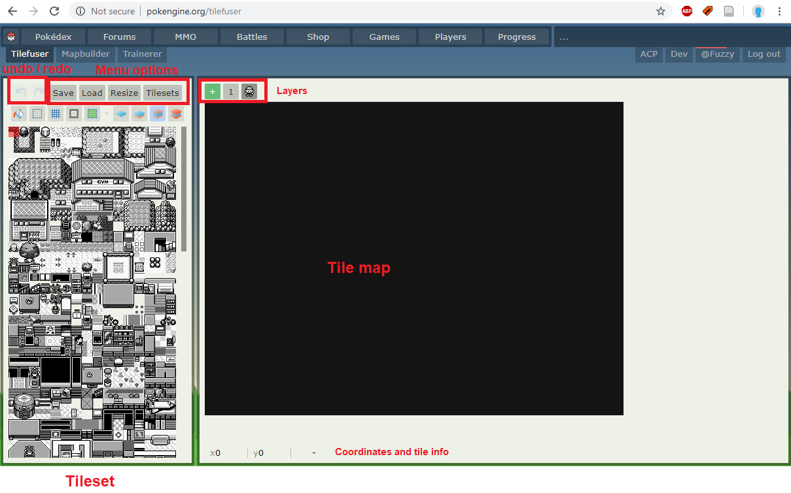
When you load Tilefuser, you will see something like this screenshot opposite: a black box in the center, a tileset on the left, and various menu options and buttons above the tileset. 

## Layers

Before you can do anything, you need to be on a layer. Layers all have numbers and can be arranged by dragging. The player icon indicates where the player would stand and is not a layer. Layers below the player will appear behind the player (like grass), while layers above the player will appear above the player and cover them up during gameplay (like bridges or tree tops). To create a new layer, press the green button.

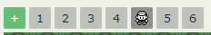

When you have a layer selected, its icon will appear darker. This means that when you place tiles, they will be placed to this particular layer. By default, the selected layer will appear in “true” colors, while layers above it will be transparent and layers behind it will be darkened.

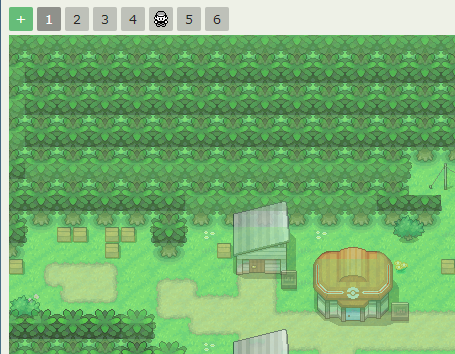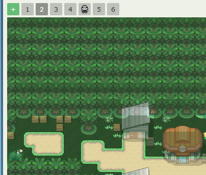

There are four layer viewing option buttons located above the tileset. Hover over them to see descriptions. The first displays only the current layer. The second displays only the current layer and layers underneath (hiding layers above). The third (default) displays both above and below layers. The fourth displays the entire map without any fading effects. You can also view the map as the player would view it (no fading effects) by clicking on the player icon in the layers.

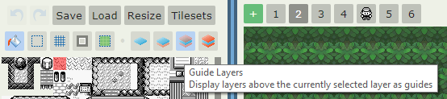

## Placing Tiles

To place a tile, simply click on it in the tileset section, then click on where you’d like to place the tile in the map section. Click and drag in the tileset section to select multiple tiles at once. The tile(s) you have selected will appear highlighted in red, and as you hover over the map, they will appear faded in the position where you would be placing them.

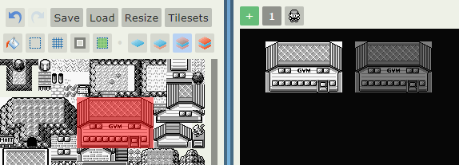

You can undo and redo by clicking the undo and redo buttons, respectively, or by using Ctrl Z and Ctrl Y, respectively.

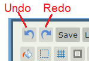

Select the fill tool to fill a space with your selected tile. When this button is selected, it will appear blue rather than gray. Remember to uncheck it when you’re done! Good thing we have an undo button.

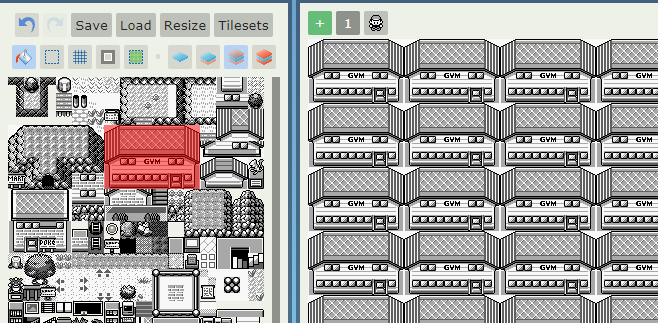

 If you have a space on the same layer entirely enclosed by tiles, then you can fill inside it.

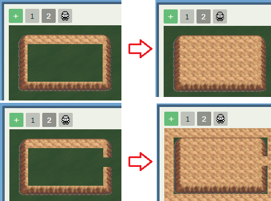

When you hover over a tile on your map, you will see the map’s x and y coordinates in the bottom of the screen as well as that tile’s image and number. Here I’m hovering over the red house’s door.

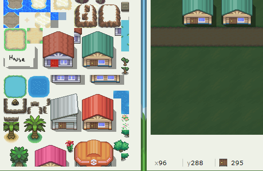

If you instead hover over the tileset, you’ll see the tileset’s x and y coordinates. The tile number will be the same. You can use the tile number to help find a tile when you’ve forgotten exactly which tile it is (useful for weird corners and shadows).

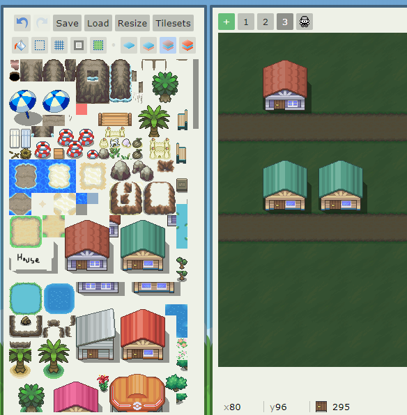

If you ++ctrl+lbutton++ click a tile on the map, it will select that tile for you to place.

## Rearranging Tiles and Resizing

If you don’t like where you placed some tiles, you can move them using the select tool. Simply click the select button, then drag on the map to select the tiles you want to move. Then, click within the highlighted area and drag the selection to its new location. A selection will only move the tiles on the selected layer. To move all layers at once, select tiles on the “player layer.” 

You can also copy and paste selections using ++ctrl+c++ and ++ctrl+v++.

!!! note

    You cannot undo/redo while in select mode. Click the select tool again to exit select mode, then you can undo/redo.

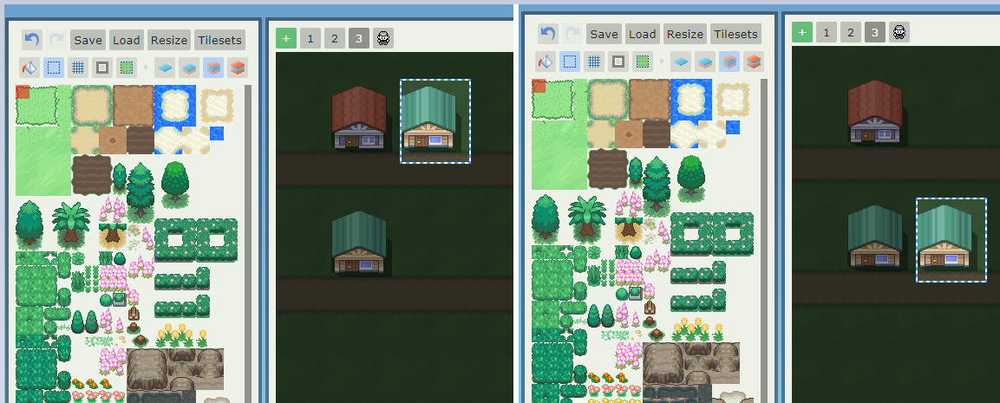
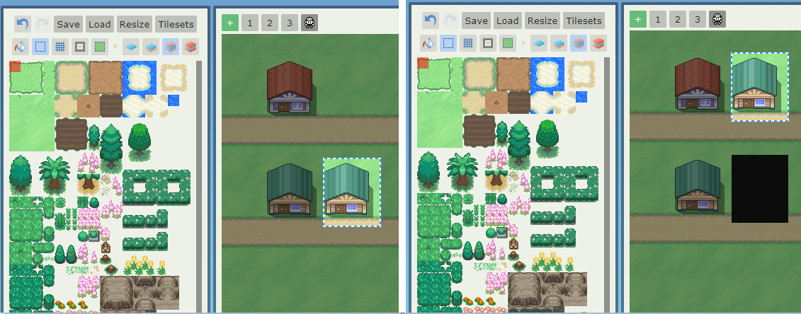

To resize a map, click the “Resize” menu button and then type the width (first box) and height (second box), in number of tiles, into the boxes. The map will resize when you click save. This cannot be undone with the undo button, so save first!!! 

If you make a map smaller but don’t refresh the page, it will remember tiles you “cropped”, and they will still be there if you make the map bigger again. All cropping and expansion happens from the right side and the bottom of the map. Use the select tool to move your map into position before resizing. 

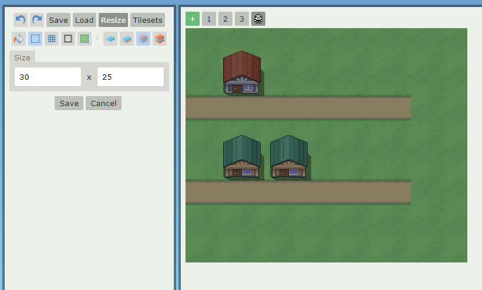

## Changing Tilesets

You can view the list of available tilesets by right clicking the tileset section or clicking the “Tilesets” menu button. You will see all the tilesets you are able to access in this area, with your current in-use tileset a darker shade of gray. Click on a tileset to begin using it. This page will also tell you which tilesets are currently being used in your map.

## Saving Your Map
To save your map, click the “Save” map button, type in a name, and click Save. If you’re saving an existing map, you will see a prompt to overwrite. Make sure you’re not saving over one of your other maps!

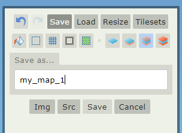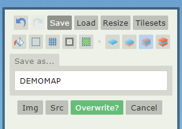

To load a map you’ve already created, go to the “Load” menu button and double click a map name. The map you currently have loaded will appear in dark gray.

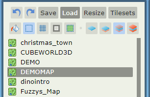

Right click on a map and then click “delete” to delete it.

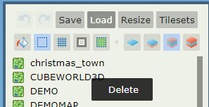

## Sharing a Tilemap

To generate a .png image for sharing your map, click the Img button in the Save menu tab. This will open a .png in a new tab or window, which you can download. 

To share a link to your map, copy the url in the format ?tilemap=USERID/MAPNAME. Be careful, as anyone who views the link can save the map to their own account. Saving maps does not give that person access to your tilesets. Use this to share maps between collaborators, or ask close friends or admins for help.

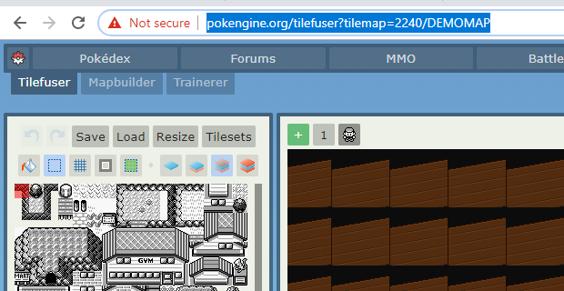

## Tilesets

As a regular user, you have access to any free tilesets on Pokengine as well as any tilesets anyone else has decided to share with you! If you ask politely, you can gain the ability to upload tilesets of your own.

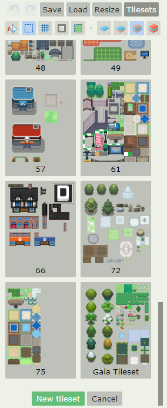

To upload a new tileset, click the green New Tileset button at the bottom of the Tilesets menu tab.

To edit an existing tileset, right click it and then click Edit. You can only edit tilesets that you uploaded yourself. 

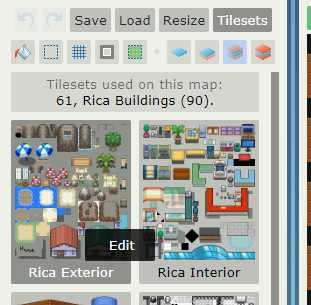

In the edit screen, you’ll see a series of options including tileset name, who is allowed to use the tileset, whether the tileset is free to use (this option will let every user see the tileset in their own Tilefuser), a preview of the tileset, and an upload option.

In the Allowed field, enter users that you want to allow to use your tileset (your collaborators). Enter names separated by a comma and space. If you want everyone to be able to use it, check the “Free to use?” checkbox. Click Save before exiting to save these changes as well as any name changes.

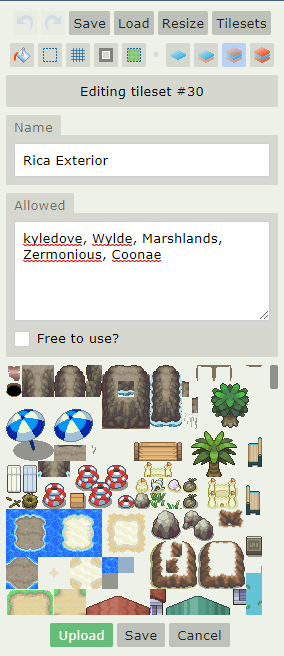

To upload a new version of the tileset, click the green Upload button. This will open a prompt to find a file on your PC. Select the correct file, and then upload it. The preview image should update. Then, click Save to save the new tileset image.

Tilesets should be 256 pixels in width and in .png format. There is no height guideline (but don’t make them too gigantic!) Each tile in a tileset (and in a tile map) is 16x16 pixels. 

### Autotiles

Autotiles are a massive time-saver! Many tiles you’ll want to be using have defined edges and interiors, for example a path: you will almost always want the path edge on the edge, and the path interior on the interior. Manually applying all the edges (including the corners) can take forever, but with autotiles, it happens automatically!

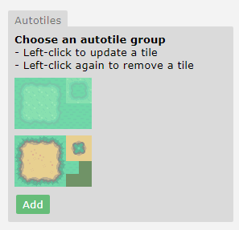

### Assigning tiles as autotiles
Only the owner of a tileset can set up which tiles are autotiles. Right-click the tileset to edit it, and then scroll to the Autotiles section which is at the very bottom.
To add a new autotile group, click Add and then you will see a blank slot (see left image). On the left, fill in the edges along the edge of the large square, with the dark green representing the edges. Fill the interior tiles into the light green part of the large square. Then, in the top right smaller square, fill in the corners (the dark again represents the edge/corner). In the bottom right square, fill in the surrounding “outer” tile if there is one. This part is not necessary.

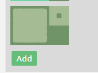

### Using Autotiles
Using autotiles is very easy - simply select any tile in the autotile group, then paint the shape that you want on the map. When you have enough tiles placed for it to fill in (in terms of width/height) then the autotile system will automatically add the edges for you!

(assets/tilefuserautotile3.gif)

You may sometimes not want the autotile system to “correct” your tiles for you. For example, if you have a path connecting across maps, you don’t want the autotile system to add the edges on either end of the two maps connecting. Hold Shift while placing tiles to disable the autotile system.

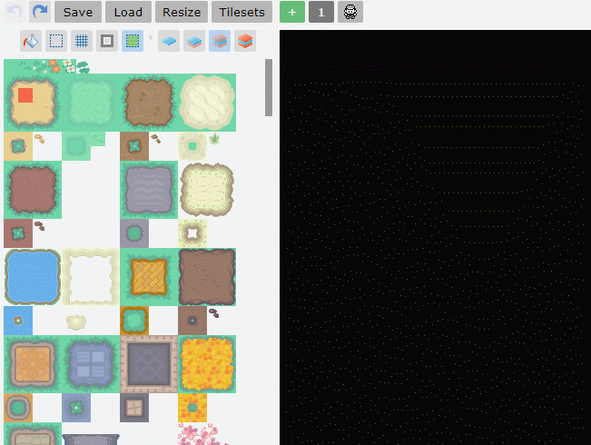

## Shortcuts

### Basic Shortcuts

- ++ctrl+z++ = Undo

- ++ctrl+y++ = Redo

- ++ctrl+c++ = Copy selection (when using Select Tool)

- ++ctrl+v++ = Paste selection (when using Select Tool)

- ++ctrl+x++ = Cut selection (when using Select Tool)

### Tilefuser-specific Shortcuts

- ++ctrl+lbutton++ = select that tile for you to place

- ++rbutton++ = return to tileset menu

- ++shift+lbutton++ = place tiles set as autotiles without    activating autotile
 

