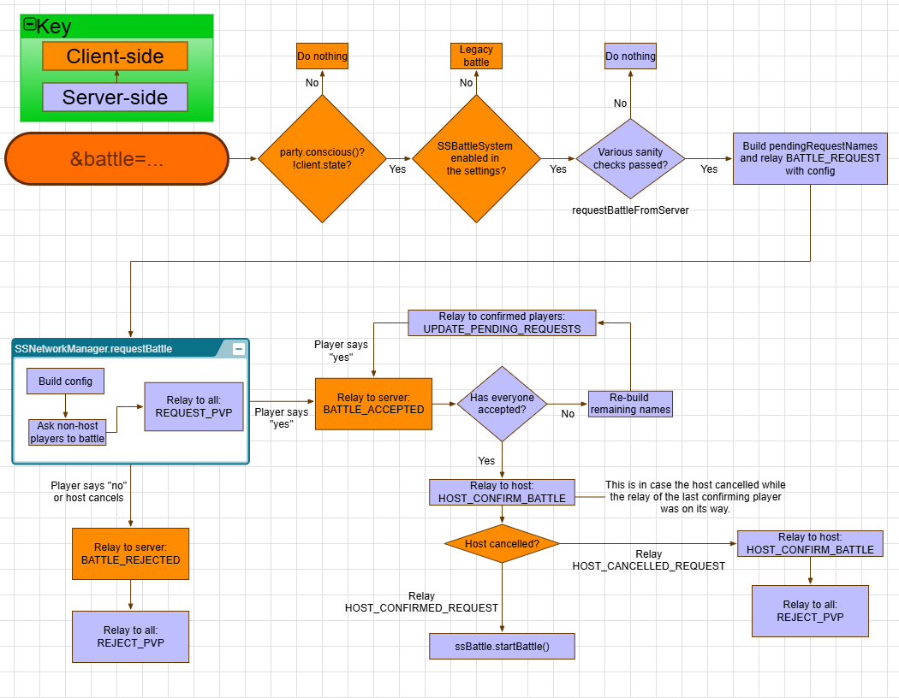
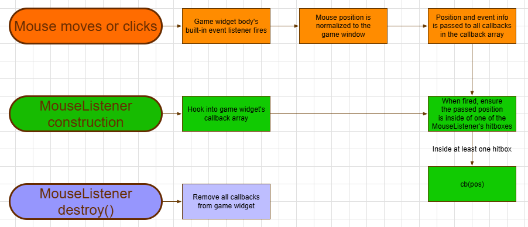
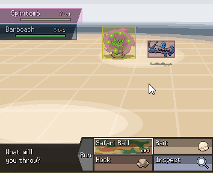

# Flowcharts

## Starting a Battle
Ultimately, battles are started on the client-side via the `&battle=` trigger using the standard [battle properties](<https://pokengine.readthedocs.io/en/latest/Code_Library/battle-properties/>).

## Mouse Events

Selecting battle targets can be done via the keyboard or mouse/touch. This is achieved using event listeners on the game widget. The class `MouseListener` serves as an interface to the game widget's listeners.

Each callback only fires if the mouse is over one of the `MouseListener`'s `UIHitbox`es.

A `UIHitbox` reads data by reference, so it changes dynamically. Moreover, it respects visibility.

