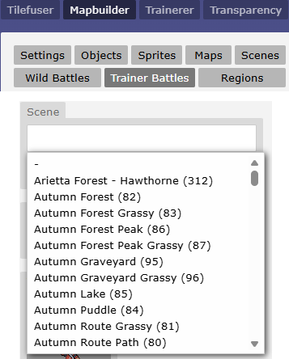
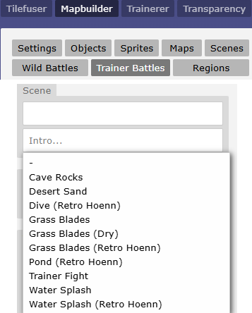

# Battle Properties
You can set various battle properties, when you call for it to start within an objects code. This applies to both wild battles and trainer battles. The properties are listed below.

## Battle Limiters
### No Running
You cannot run from this battle. This is the default setting for trainer battles, so you only need to specify it for wild battles.
```json
norun
```
### No Catching
You cannot catch the opposing Pokemon. This is the default setting for trainer battles, so you only need to specify it for wild battles.
```json
nocatch
```
### No Money
You will not earn money from this battle. This is the default setting for wild battles, so you only need to specify it for trainer battles.
```json 
nomoney
```

### Fixed amount of Money
The player will earn this amount of money from winning the battle.
```json 
payout value
```

### No Experience Points
Your Pokemon will not gain any experience points from this battle.
```json
noexp
```

### Never Shiny
The encountered mon will never be shiny.
```json
noshiny
```

### No Item Use
You will not be able to use items from the bag widget during battle. For example, Poke Balls or Potions.
```json 
noitems
```

### No Blacking Out
Prevents the player from blacking out if they lose the battle.
```json 
noblackout
```

### No Mega Evolutions
Prevents the mega evolutions from occurring.
```json 
nomegas
```

### Set Style
The battle uses set style (the player is not asked to switch before the opponent sends out a new mon).
```json 
setstyle
```

### Fixed Pokemon Level
Forces all Pokémon in battle to the specified level. Uses their true stats (IVs, EVs) but calculates the actual stat value (attack, etc) based on the new set level. This works identically to fixed level battles such as the Battle Tower in the mainline games.
```json
fixedlevel
fixedlevel level
fixedlevel side1,side2
```

- If no arguments are given, each side is level 50.
- If one argument is given, each side uses that level.
- If two arguments are given, each side has a different fixed level (e.g., `fixedlevel 50,60`).
### Hidden Opposing Pokemon Level
Levels of the opposing Pokémon are hidden. Appears as ???.
```json 
hiddenlevel
```

### Mon Order
Causes the NPC to use mons in the order specified (by comma-separated slots).
```json 
monorder list
```
Here, `list` is comma-separated slots, like `2,1,3`. You can also include `r` for a random slot, like `2,r,3`.

## Automatic Evolution

When [dynamic leveling](<https://pokengine.readthedocs.io/en/latest/Code_Library/pokemon-generation/#dynamic-levelling>) is active, sometimes it makes sense for the Pokémon to automatically evolve. This is great for situations where the player might otherwise encounter a level 25 Caterpie.

```json 
autoevolve mode
```

When enabled, automatic evolution has four modes:

- Mode 1 - Default, will evolve mons via level-up. Non–level-ups (such as stone evolutions) will evolve at specific breakpoints and will prioritize the first evolution in an evolutionary chain.
- Mode 2 - Will specifically prioritize alternate evolution methods (such as stone evolutions) instead of level-up evolutions.
- Mode 3 - Will pick all possible evolutions, but will remain consistent across every battle due to seeding. For example, a battle that uses a Rockruff and Mode 3 may result in having a Lycanroc Midnight. Due to seeding, once the Lycanroc Midnight is chosen once, it will also be chosen at different levels for that particular encounter.
- Mode 4 - Only evolves level-up evolutions, non–level-ups do not evolve.

If you want to configure autoevolve for all battles on a map, you can use the trigger
```json 
mapvar[autoevolve_all]=mode
```
Similarly, for all battles in a region, you can set the variable in the region variables:
```json 
var[autoevolve_all]=mode
```

## Weather
Sets the weather before the battle starts.

```json 
weather name
```

Options are:

<style>
.weather-columns ul {
    margin-top: 0;
}
</style>

<div class="weather-columns" style="column-count: 3; column-gap: 20px;" markdown="1">
- `ash`
- `blizzard`
- `bubbles`
- `cherry`
- `clear`
- `confetti`
- `downpour`
- `duststorm`
- `fog`
- `grassblades`
- `hail`
- `hailstorm`
- `leaves`
- `mist`
- `pink-petals`
- `rain`
- `soot`
- `spooky`
- `sparkles`
- `spore`
- `sprite`
- `steam`
- `storm`
- `strong winds`
- `snow`
- `windy`
- `yellow-petals`
</div>

## Battle Format
### Double Battles
The battle will be changed to the 'double' format of Pokemon battles. This can be applied to both wild and trainer battles.
```json
double
```
### Triple Battles
The battle will be changed to the 'triple' format of Pokemon battles. This can be applied to both wild and trainer battles.
```json 
triple
```
### Safari
Enables the battle to be safari-style (special catch rules).
```json 
safari
```
### Horde Battles
Creates a horde battle (1 vs N opponents that duplicates a single wild mon).
```json 
horde
horde N
```
If `N` is omitted, a random number between 1 and 6 will be selected.

### Ghosts!
Enemy combatants are treated like ghosts. Similar to Marowak's ghost in Lavendar Town, the player's mons will not be able to attack.
```json 
ghosts
```

### PvP
Configures the match to be player-vs-player (no victory/defeat speech, can forfeit without blacking out, forces set style, allows held items to be recovered, and so on).
```json
pvp
```

### Not Wild
Makes the introductory text "A Magikarp approches for battle!" instead of "A wild Magikarp appeared!".
```json
notwild
```

## Pokedex Registration

### Not Seen in Pokedex
The opposing Pokemon in this battle, will not be counted as seen in the Pokedex.
```json
noseen
```

## Set ev on Caught
Sets an ev to be saved upon successfully catching the wild mon.
```json 
oncaught ev[name]=value
```

## Battle Scene Alterations

### Battle Background (Scene)
Sets the battle scene (background image) to the one specified. Only necessary for wild battles, as trainer battles have a scene property set in advance. Additional scenes are added for battles, using the scene context menu in the Mapbuilder editor.


```json
scene id
```
Id options are the numbers that appear in parentheses (e.g., `82` for Autumn Forest).

### Battle Intro
Sets the battle intro (animation) to the one specified. Similar to scenes, the intros may be found in the context menu in the Mapbuilder editor.


```json
intro name
```
Name options are

- `cave`
- `sand`
- `retro-hoenn-dive`
- `grass`
- `grass-dry`
- `retro-hoenn-grass`
- `retro-hoenn-pond`
- `trainer`
- `splash`
- `retro-hoenn-splash`.

### Battle Theme (Audio)
Sets the music playing during battle. Currently, only hosting on Dropbox is supported. The format is db: for host, then a modified URL which cuts out the https://www.dropbox.com/ part.
```json
theme url
```
Usage:
```json
theme db:s/fo7smcp2luvrikc/BattleTowerSWSHRemix.mp3
```
See also [Setting a Song for Specific Trainer Battles](<https://pokengine.readthedocs.io/en/latest/HowTo_Guides/music-settings/#setting-a-song-for-specific-trainer-battles>).

### Victory Theme
Similar to the battle theme, you can select a track to play when the player whens the battle.
```json
victorytheme url
```
## Transition
Sets the screen transition animation used when entering the battle.
```json 
transition type
```
Type options:

- `0` - Diagonal wipe (64×64 squares sweep diagonally across the screen)
- `1` - Grid fade (16×16 grid lines fade in)
- `2` - Venetian blinds (alternating 16px horizontal strips fade from top and bottom)
- `rocket` - Team Rocket style transition (animated 12-frame sprite sheet)
- `-1` or omitted - Random transition (picks 0, 1, or 2 randomly)

### No Shadow
Neither teams' mons will cast shadows.
```json 
noshadow
```

## Examples
### Wild Pokemon Boss
This first example is a boss battle against a wild Pokémon. You cannot run or catch it, and the level is hidden. The Pokémon’s name is also set to hide its species.
```json title="Code Example" 
msg(Groouuugoooough!!)&!cry=00bxxu0w&battle=00bxxu0w;level 80;name ???;scene 51;hiddenlevel;nomoney;nocatch;norun
```

### Battle Tower
Battle Tower This example is from the HUB Battle Tower. The dialogue in the `msg()` block and the trainer battle ID are both controlled by a list. The variable `var[noblackout]=1` is set so that the player will not teleport away if they lose the battle.

Similar to the mainline games’ Battle Tower, this battle gives no exp or money, but instead I manually give the player BP if they win (not shown). Items are not allowed, and all participating Pokémon are set to level 50 for the duration of the battle.
```json title="Code Example" 
msg(%list[trainers][n].speech%)&var[noblackout]=1&mapvar[battle]=3&battle=%list[trainers][n].battleid%;noexp;nomoney;noseen;noitems;fixedlevel 50;theme db:s/fo7smcp2luvrikc/BattleTowerSWSHRemix.mp3
```

## Advanced - AI Routines

**Overview**

Routines are comma-separated tokens that control NPC AI behaviour for move selection, switching, item use, hazard/weather setup, and other decisions. They are set per-npc (not per-mon).

**Source precedence:**

1. `config.routines` (battle config string, described here)
2. `trainer.skillLevel` (trainer instance)
3. `TRAINERS[individual]` or `TRAINERS[trainerClass].skillLevel`
4. fallback: `["beginner"]` for trainers, `["random-5"]` when no trainer

**Format:**

```json
routines token1,token2,token3
```

**Examples:**

- Custom behavior

```json
routines aggressive,switchout
routines skilled,nouseitems
```

- Basic trainer with simple AI:
  ```json
  routines beginner
  ```

- Advanced trainer that sets hazards and switches strategically:
  ```json
  routines skilled
  ```

- Custom trainer that damages but never uses items:
  ```json
  routines damage,typing,stab,random-5,nouseitems
  ```

- Trainer that only sets weather and hazards:
  ```json
  routines setweathers,sethazards,random-3
  ```

You can negate a routine by prefixing with `no`: e.g., `nosetweathers` removes the `setweathers` routines during preprocessing.

**Predefined routine groups**

- `noob` → `damage`, `typing`, `failedmove-3`, `useitems`, `random-5`
- `beginner` → `damage`, `typing`, `stab`, `inflictstatus`, `failedmove-1`, `useitems`, `random-5`
- `skilled` → `damage`, `typing`, `stab`, `accuracy`, `inflictstatus`, `failedmove-1`, `switchout-0.5`, `sethazards`, `setweathers`, `statboost`, `useitems`, `random-5`
- `expert` → same as `skilled`
- `inflictstatus` → `inflictparalysis`, `inflictsleep`, `inflictpoison`, `inflictburn`, `inflictfreeze`, `inflictconfusion`, `inflictinfatuation`
- `sethazards` → `stealthrock`, `spikes`, `toxicspikes`, `stickyweb`
- `setweathers` → `rain`, `harshsunlight`, `sandstorm`, `snow`, `darkovercast`, `fog`

**Atomic routines and what they do**

- `random-N`
    - Adds `randInt(1, N)` to base target scores; larger N increases randomness and tie variance.
    - Example: `random-5` adds 1–5 random points per target.

- `typing`
    - Enables type-effectiveness checks for relevant routines (damage and status infliction).

- `stab`
    - Apply STAB multiplier (1.5×) for damage scoring when move type matches user type.

- `accuracy`
    - Multiplies final scores by `move.accuracy / 100` to prefer more accurate moves.

- `damage`
    - Prioritizes damaging moves proportional to `move.power` (or flat value for flat-dmg moves), modified by effectiveness, STAB, multi-target penalty, and same-team penalties for moves hitting allies.
    - Penalizes ineffective moves by subtracting the control value.

- `inflictstatus` (batched group expands to specific tokens below)

- `inflictparalysis` / `inflictsleep` / `inflictpoison` / `inflictburn` / `inflictfreeze` / `inflictconfusion` / `inflictinfatuation`
    - For status moves with the matching tag, increases score (+15 to +20) vs viable targets (not already afflicted, not immune, opposing team).
    - Penalizes invalid targets (already statused, immune type, or same team).

- `failedmove-X`
    - Penalizes moves that have failed X or more times against the same target.
    - Example: `failedmove-1` penalizes any move that has failed once; `failedmove-3` only penalizes after 3 failures.
    - Penalty increases with repeated failures: `-30 × (failures - X + 1)`.

- `statusmoves-N` / `dmgmoves-N` / `physicaldmgmoves-N` / `specialdmgmoves-N`
    - Boosts scores for moves of the specified category by N points.
    - Example: `statusmoves-10` adds +10 to all status moves.

- `stealthrock` / `spikes` / `toxicspikes` / `stickyweb`
    - Prefers setting the hazard if it's not already present on the opponent's side (+20 score).
    - For `spikes` and `toxicspikes`, also prefers topping up layers if not at max.
    - Penalizes trying to set hazards when already maxed out.

- `rain` / `harshsunlight` / `sandstorm` / `snow` / `darkovercast` / `fog`
    - Prefers setting the weather if it's not already active (+15 if clear, +30 if overriding another weather).
    - Penalizes trying to set the same weather again.

- `statboost`
    - Prefers stat-boosting moves when the mon was sent out without moving and is still out (+35 score).
    - Penalizes otherwise.

- `switchout-X`
    - Enables switching behavior. When present, the AI evaluates teammates to switch in and computes a switch-out score.
    - The numeric suffix X is a score penalty multiplier (default 0.5). Lower values make switching more attractive.
    - Example: `switchout-0.5` applies a 50% penalty to the teammate's best move score when evaluating whether to switch.
    - The AI checks if the mon can switch out (volatile statuses, abilities, held items) before attempting.

- `useitems`
    - Evaluates usable items in the trainer's bag and may choose to use one as an action.
    - Currently supports healing items (prioritizes when mon HP < 35% or when heal amount is efficient).
    - Tracks items already used this turn to avoid repeats.

- `savelastmon`
    - When evaluating teammates to switch in, avoids choosing the final remaining healthy mon.
    - Used in `getTeammateToSwitchIn` to prevent sending out the last mon prematurely.

**Notes**

- Routines are processed in order; later routines can override earlier ones if they share a prefix (though deduplication behavior may vary — see preprocessing rules).
- Many routines rely on move tags (e.g., `"paralysis"`, `"stealth rock"`, `"rain"`) to detect move capabilities. Ensure your move data is consistently tagged.
- The `random-N` and various score bonuses (15, 20, 30, etc.) heavily influence AI determinism. Tuning these values changes how predictable the AI is.
- The AI uses heuristic scoring rather than game-theoretic optimization; it's designed to be configurable and readable.

