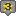
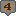

# Triggers
## Programming

### Pause
Pauses trigger execution for a given amount of time.
```json
&pause=ms
```
**ms***(number)*
: Time in milliseconds to wait before preceding.

### With
Targets the following triggers on the given entity.
```json
&with=targetname
```
**targetname***(string)*
: New target name.
**Default**: Re-targets the player.

### Variable
Updates the variable.
```json 
&var[name]=value
```
**name***(string)*
: **REQUIRED**: Name of the variable.

**value***(string)*
: New value of the variable.

### Map Variable
Updates the map variable.
```json
&mapvar[name]=value
```
**name***(string)*
: **REQUIRED**: Name of the map variable.

**value***(string)*
: New value of the map variable.

### Event Variable
Updates the event variable.
```json
&ev[name]=value
```
**name***(string)*
: **REQUIRED**: Name of the event variable.

**value***(string)*
: New value of the event variable.

## Entity Manipulation
### Freeze
Freezes the target and prevents player input.
```json
&freeze=target
```
**target***(string)*
: Target to freeze.
**Default**: Player

### Unfreeze
Unfreezes the target and allows player input.
```json
&unfreeze=target
```
**target***(string)*
: Target to unfreeze.
**Default**: Player

### Destroy
Unfreezes the target and allows player input.
```json 
&destroy=target
```
**target***(string)*
: Target to destroy.
**Default**: The current target.

### Jump
Causes the target to jump.
```json
&jump=height
```
**height***(number)*
: Number of pixels the target will jump by.
**Default**: 8 pixels.

### Direction
Causes the target to face the given direction.
```json title="&direction" 
&direction=u or &direction=up
&direction=d or &direction=down
&direction=l or &direction=left
&direction=r or &direction=right
```
**direction***(string)*
: The name of the direction the target will face.

### Path
Moves the target along the given path.
```json
&path=path
```
**path***(path)*
: Path for the target to follow.
**Default**: Unsets the current path.

### Speed
Sets the targets speed. Can be used on the player.
```json
&speed=percentage
```
**percentage***(percentage)*
: Percentage of normal speed. Use `50` for half speed or `200` for double speed.
**Default**: 100

### Icon Bubbles
Places an animated icon bubble above the targets head. Can be used on the player.
```json 
&icon=id
```
**id***(number)*
: Icon ID to display.

**Default**: Removes any icon.

Icon Name | ID | Symbol
------------|-------------|-------------
Exclamation | 1 | 
Ellipses | 2 | 
Smiley Face | 3 | 
Music Note | 4 | 
Comma | 5 | 
Joyful Face | 6 | 
Heart | 7 | 
Sad Face| 8 | 
Smiling Face with Open Mouth | 9 | 
Fish Icon | 10 | 
Angry Face | 11 | 
Battle | 12 | 
Haha | 13 | 
No. 1 | 14 | 
No. 2 | 15 | 
No. 3 | 16 | 
No. 4 | 17 | 
No. 5 | 18 | 
Poisoned | 19 | 
Surprised Face | 20 | 
Shaking Head | 21 |
Question Mark | 22 |
Asleep | 23 | 
Sweat Drop | 24 | 
Skull (Dead) | 25 | 
Big Red Exclamation Mark | 26 | 
Spectating Eye | 27 | 
Crying/Screaming | 28 | 
Egg | 29 | 
Flight Icon | 30 | 
Spanish Flag | 31 | 
Star No 1 | 32 | 
Star No 2 | 33 | 
Star No 3 | 34 | 
Star No 4 | 35 | 
Star No 5 | 36 | 
Quest (Not Started) | 37 | 
Quest (In Progress) | 38 | 
Quest (Completed) | 39 | 
Healer | 40 | 
Shop | 41 | 
TM | 42 | 
French Flag | 43 | 
Gift | 44 | 
Quest Star | 45 | 

### XY Coordinates
Instantly warps the target to the specified coordinates on the current map.
```json
&xy=x,y
```
**x***(number)*
: X-coordinate to warp to.

**y***(number)*
: Y-coordinate to warp to.

### Moveto Coordinates
Moves the target to the specified coordinates on the current map by taking the straight-line path.
```json
&moveto=x,y,direction
```
**x***(number)*
: X-coordinate to move to.

**y***(number)*
: Y-coordinate to move to.

**direction***(string)*
: Direction to face while moving.

**Default**: Current Direction

### Follow
Forces the current target to follow another target.
```json 
&follow=target
```
**target***(string)*
: Specify the target to follow.

**Default**: Unfollows.

### Behind Player
Puts the current target behind the player.
```json
&behindplayer
```
### Outfit
Sets the target’s skin.
```json
&outfit=skin
```
**skin***(skinid)*
: Specify the skin ID for the target to change to.

### Texture
Sets the target’s texture.
```json
&texture=sprite
```
**texture***(sprite sheet)*
: Texture sprite to change to.

### Skin Color
Sets the target’s skin color.
```json
&skincolor=id
```
**id***(number)*
: Skin color ID to change to.

**Default**: 0

### Ally
Sets the target’s allies, or following entities.
```json
&ally[=ally1 [ally2 [ally3...]]]
```
**ally***(skin)*
: Overworld skin of following ally. For multiple allies, separate with spaces.

### Floating
Causes the target to float.
```json
&floating[=height]
```
**height***(number | yes)*
: Number of pixels high to float. `yes` defaults to 10 pixels.

**Default**: Stops Floating

### Spin
Causes the target to float.
```json
&spin[=choice]
```
**spin***(yes | no)*
: Should the target spin?

**Default**: No

### Solid
Turns the target solid.
```json
&solid[=choice]
```
**choice***(yes | no)*
: Should the target be solid?

**Default**: No

### Print
Creates a fading trail behind the target.
```json
&print[=type]
```
**choice***(yes | no)*
: Type of trail to draw.

**Default**: No trail

### Outline
Creates a fading trail behind the target.
```json
&outline[=color]
```
**color***(rgb)*
: Draws a colored outline around the target.

**Default**: Removes Outline

### Color
Sets the glow color of the target.
```json
&color[=color]
```
**color***(rgb)*
: Glow color. Three RGB values separated by commas.

**Default**: Removes glow color

### Glide
Causes the target to glide, which removes the target’s walking animation.
```json
&glide[=choice]
```
**choice***(yes / no)*
: Should the target glide?

**Default**: No

### Walk Through Walls
Causes the target to walk through walls.
```json
&wtw[=choice]
```
**choice***(yes / no)*
: Should the target walk through walls?

**Default**: No

### Repel
Causes the target to repel wild Pokémon encounters.
```json
&repel[=choice]
```
**choice***(yes / no)*
: Should the target have repel activated?

**Default**: No

### Depth
Sets the depth of the target.
```json
&depth[=z]
```
**z***(number)*
: Target’s new depth.

**Default**: 0

### Opacity
Sets the target’s opacity.
```json
&opacity[=percentage]
```
**percentage***(percentage)*
: Target’s opacity.

**Default**: 100

### Untile
Removes a target’s `ontile` activation, allowing it to trigger an `ontile` condition again without needing to move.
```json
&untile[=target]
```
**target***(string)*
: Target to impact.

**Default**: Current Target

### Unspot
Resets a target who has spotted the player.
```json
&unspot[=target]
```
**target***(string)*
: Target to impact.

**Default**: Current Target

## Sprite Manipulation

### Animate
Forces the target to animate.
```json
&animate[=percentage]
```
**percentage***(percentage)*
: Percentage of the normal speed to animate at.

**Default**: 100

### Frame
Forces the target to pause on the given frame number.
```json
&animate[=percentage]
```
**frame***(number)*
: Frame number to pause on.

**Default**: 0

### Sprite
Adds a new (potentially animated) sprite to the map. See `animation()`.
```json
&sprite[name]=x,y,file,depth,image_x,image_y,image_width,image_height,frames,speed,loop,unsynced
```

## Player Events

### Warp
Warps the player to a spawn point on a different map.
```json
&warp=map,spawn
```
**map***(number)*
: Map ID to warp to.

**spawn***(number)*
: Spawn ID to warp to.

### Textbox
Displays a textbox, separate to `msg`.
```json
&textbox[=text]
```
**text***(string)*
: Destroys the current textbox

### Answers
Gives the player one or more answers to select. Answers should be separated by commas.
```json
&answers=answer1[,answer2,...]
```
**answer***(string)*
: A single answer.

### Battle
Initiates a battle. 
```json
&battle=id
```
**id***(number)*
: Battle ID to initiate.

### No Blackout
Prevents the user from "blacking out" and heading to the Pokemon Center or defined heal point.
```json
&noblackout
```

### Answers
Gives the player one or more answers to select. Answers should be separated by commas.
```json
&answers=answer1[,answer2,...]
```
**answer***(string)*
: A single answer.

### Message
Activates a target’s `name.msg()` property without the player needing to interact with them.
```json
&msg[=target]
```
**target***(string)*
: Target to activate.

**Default**: Current Target

### Item
Gives the player a given amount of some item.
```json
&item=item[,amount]
```
**item***(string | number)*
: Name or ID number of the item.

**amount***(number)*
: Number of items to give. Use a negative number to take items away from the player.

**Default**: 1

### Mon
Gives the player the generated Pokémon.
```json
&mon=pokemon
```
**pokemon***(pokemon)*
: Pokémon to give.

### Show
Shows the player a Pokémon.
```json
&show=pokemon
```
**pokemon***(pokemon))*
: Pokémon to show.

### Trade
Trades one type of Pokémon in the player’s party for a new Pokémon.
```json
&trade[whom]=for_whom
```
**whom***(pokemon))*
: Type of Pokémon needed to trade.

**for_whom***(pokemon))*
: Pokémon the player receives.

### Giveaway
Gives away one Pokémon forever, removing it from the player’s party
```json
&giveaway=whom
```
**whom***(pokemon))*
: Type of Pokémon able to be given away.

### Money
Adds money to the player’s wallet.
```json
&money=amount
```
**amount***(number))*
: Amount of money to add. Use a negative number to take money away.

### Coins
Adds coins to the player’s coin case.
```json
&coins=amount
```
**amount***(number))*
: Amount of coins to add. Use a negative number to take coins away..

### Starter
Gives the Pokémon to the player as a starter. Players may only receive one starter per region.
```json
&starter=pokemon
```
**pokemon***(pokemon))*
: Starter Pokémon to give.

### Heal
Heals the target’s party.
```json
&heal
```

### Badge
Gives the user a gym badge.
```json
&badge=badge
```
**badge***(number))*
: Badge ID to give to the player.

### Achievement
Advances the given achievement by 1.
```json
&achievement=id
```
**id***(number))*
: Achievement ID to advance.

### Travel
Activates the region travel menu.
```json
&travel
```

### PC
Activates the PC.
```json
&pc
```

### Hall of Fame
Activates the Hall of Fame cutscene for the current region.
```json
&halloffame[=dex]
```
**dex***(0/1)))*
: Display Dex progress at the end?

**Default**: 0

### Move Learner
Creates a move tutor interface of either the moves the mon should be able to know based on level, or from a given list.
```json
&movelearner=max[:number];slot[:number];lock;illegal;cost[:itemUID|money|soot|coins|ev[evName]|mapVar[mapVarName] amount];moves[:moveUID,nextMoveUID,...]
```

If a region variable “move_learner_context” is set, users can right-click mons in their party to relearn moves directly.

Parameters are separated by `;`.

`&movelearner` will open the move relearn interface, with no cost, allow the user to learn multiple moves without being kicked out, and let user swap between mons.

`&movelearner=max:1;cost:money 1000;moves:07nhrhjt;` will open a “move tutor” who costs 1000 money to learn a move, kicks the user out after teaching 1 move, and only teaches Explosion.

**max***(number)))*
: The number of moves that can be learned in this instance of using the tutor. Used in conjunction with `cost:` to forcibly close the tutor after a move is learned.

**slot***(number)))*
: A number between 1 and 6, specifies which mon the tutor should open to. Defaults to 1. Ex: `slot:3` would open to the third slot.

**lock**
: Specifying just `lock;` will make it so the user cannot swap to different mons while in the interface.

**illegal**
: Allows moves in the interface to be taught regardless of whether or not the mon should be allowed to know it. USE WISELY.

**cost***(string)))*
: List of values in `type amount, type2 amount2, etc.;` format, separated by commas.

What cost should be paid per move learned. It is HIGHLY recommended you also set `max:1` when using this. The tutor interface does NOT check if the user can pay said cost, you will need proper if conditions preceeding its use.

This supports itemUIDs, money specifications such as `money,` `soot,` `coins,` or even `ev` or `mapVar` for using `ev[BP]` etc. If no amount is specified, the default value 1 will be used. If the mapVar or ev doesn’t exist, one will be made at value 0 and the amount will be subtracted from it.

Multiple costs may be defined by separating each with commas, and ALL costs will be paid upon teaching a move.

Costs will be paid upon the move being taught and saved, to avoid refresh-cheating the system’s costs.

**moves***(string)))*
: String of move UIDs separated by commas. `moves:UID,UID2,UID3,etc.;`

Optional, but if provided will change this interface from a “move relearn” interface to a “move tutor” interface.

### Shop
Creates a shop with the listed items and prices. An infinite list of items can be provided, with each item being separated by a comma.
```json
&shop=item[:price],[item[:price],...]
```
**item***(string | number)))*
: Item name or number to sell.

**price***(number)))*
: Price for one item. This price cannot be less than the item’s sell price.

**Default**: Default Price

### Buy
Creates a shop with the listed items and prices, similar to &shop. However, the player may not sell items here; only the buy option is activated.
```json
&buy=item[:price],[item[:price],...]
```
**item***(string | number)))*
: Item name or number to sell.

**price***(number)))*
: Price for one item. This price cannot be less than the item’s sell price.

**Default**: Default Price

### Sell
Creates a menu that only allows the player to sell items.
```json
&sell
```
### Replay
Replays a previous battle for the player. Basically initiates a battle where the player does nothing.
```json
&replay=id
```
**id***(number)))*
: Replay ID to watch.

### Rival
Puts the `/rival` command into the player’s chat.
```json
&rival
```
### Cycle
Causes the player to start riding a bicycle.
```json
&cycle=choice
```
**choice***(yes | no)))*
: Ride a bicycle?

**Default**: No

### Surf
Causes the target to start surfing.
```json
&surf=choice
```
**choice***(yes | no)))*
: Surf?

**Default**: No

### Safari
Puts the player in a Safari Zone, where they have a certain number of steps before being warped away.
```json
&safari[=steps]
```
**steps***(number)))*
: Number of steps in the Safari Zone.

**Default**: Unsets the state

## Game Appearance

### Fadeout
Fades the screen out to a solid color.
```json
&fadeout[=color]
```
**color***(hex)))*
: Solid color to fade out to.

**Default**: Black

### Fadein
Fades the screen in, starting from the given color.
```json
&fadein[=color]
```
**color***(hex)))*
: Solid color to fade in from.

**Default**: Black

### Flash
Flashes the screen with a solid color.
```json
&flash[=color]
```
**color***(hex)))*
: Solid color to flash.

**Default**: White

### Palette
Changes the game’s palette. Used in retro maps.
```json
&palette[=hexhex]
```
**hexhex***(string)))*
: Two colors, formatted as twelve hexadecimal digits (`[0-F]{12}`) all together. The first six digits represent the primary color, and the second six digits represent the secondary color.

**Default**: Unsets

### Dawn
Changes the game time to dawn (06:00).
```json
&dawn
```

### Day
Changes the game time to day (12:00)..
```json
&day
```

### Dusk
Changes the game time to dusk (18:00).
```json
&dusk
```

### Night
Changes the game time to night (20:00).
```json
&night
```

### Time
Changes the game time.
```json
&time[=h:m]
```
**h:m***(string)))*
: Time in 24-hour format.

**Default**: Resets to server time

### Lighting
Changes the game’s overlay lighting.
```json
&lighting[=color]
```
**color***(rgb)))*
: Color of the game's overlay lighting.

**Default**: Resets to map or time lighting

### Shake
Shakes the screen, as if there was an earthquake.
```json
&shake[=x,y]
```
**x***(number)))*
: Number of pixels to shake horizontally.

**Default**: 0

**y***(number)))*
: Number of pixels to shake vertically.

**Default**: 0

### Lookat
Moves the game camera to the given coordinates on the map.
```json
&lookat[=x,y]
```
**x***(number)))*
: X-coordinate of target tile.

**Default**: Player

**y***(number)))*
: Y-coordinate of target tile.

**Default**: Player

### Weather
Sets the weather the player sees.
```json
&weather[=type]
```
**type***(string)))*
: Type of Weather

**Options**: downpour, rain, storm, blizzard, snow, hail, hailstorm, fog, mist, spooky, sandstorm, soot, kyle, cherry, confetti, overcast, harsh sunlight, strong winds

**Default**: Resets to no weather.

## Sounds

### SFX
Plays a sound file.
```json
&sfx=sound
```
**sound***(string)))*
: Some name of a `.ogg` file.

### Track
Plays a sound track.
```json
&track[=track]
```
**track***(string)))*
: Track to play. Track can be some name of a .ogg file, or it can be a hosted music piece. See Music Settings and Uploading for more details in the How To Guides. 

**Default**: Stops playing any track.

### Cry
Plays a Pokémon cry.
```json
&cry=pokemon
```
**pokemon***(ID)))*
: Plays a Pokémon’s cry based on ID of Pokemon entered.

## Client Properties

### Zoom
Changes the client’s game window scale.
```json
&zoom[=scale]
```
**track***(string)))*
: Zoom setting. Use `1` for 100%, or use `0.5` for 50%.

**Default**: `2` for 200%

### View
Sets the dimensions of the client’s game window.
```json
&view[=wxh]
```
**wxh***(string)))*
: Width and height of the game window. Use `normal` to reset.

**Default**: normal

### Filter
Generates a filter over the game screen.
```json
&filter[=type]
```
**type***(string)))*
: Filter to display.

**Options**: crt, oldfilm, glitch, shockwave, bloom, ascii, godray, rgbsplitter, pixelate, underwater

**Default**: Remove any filter

## Other

### Refresh
Refreshes the client’s game. Equivalent to pressing F5 on desktop.
```json
&refresh
```
