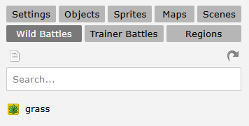
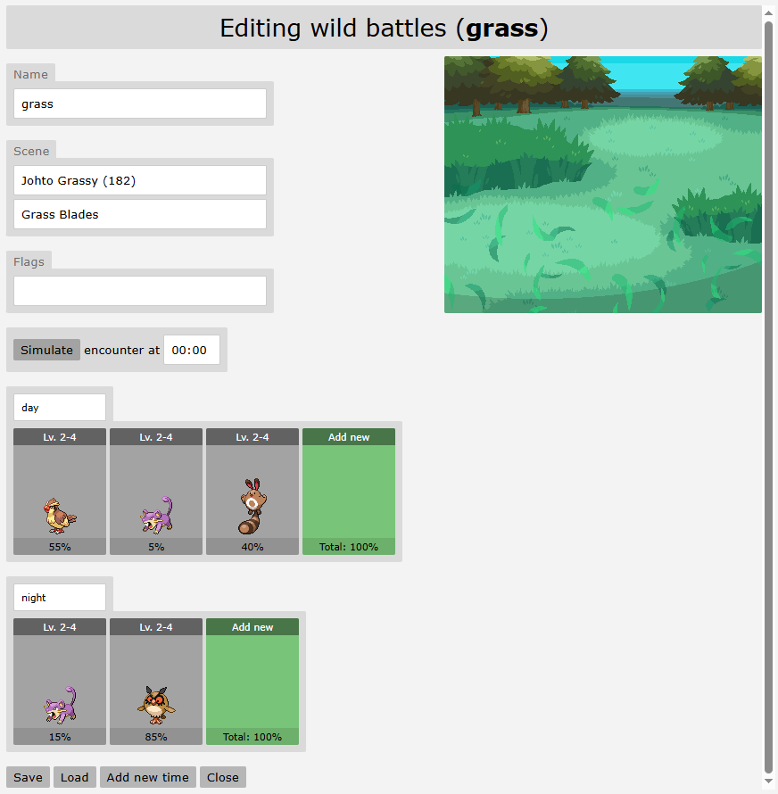
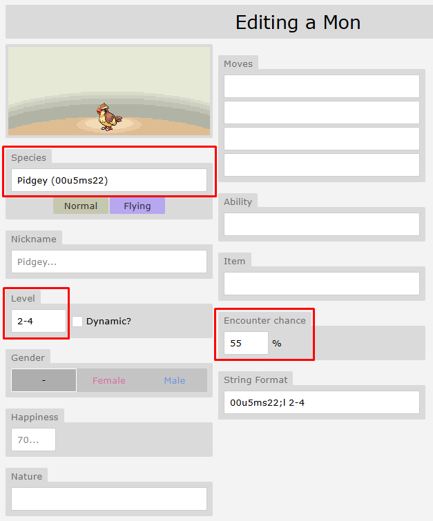
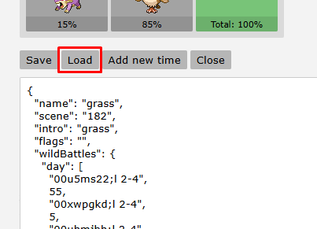

# Grass Encounters (How to)

The most common way to encounter wild Pokémon is through grass tiles.  
To get started, create a reusable root object that you can place throughout your region. Here are two examples:

**Sinnoh**
```
encounter(grass)
grass(1995/atlasgrassanimation,3,100,1995/sinnoh-grass)
if ontouch=player
execute(sfx=grasswalk.ogg)
```

**Johto**
```
encounter(grass)
grass(1995/atlasgrassanimation,3,100,1995/johto-grass)
if ontouch=player
execute(sfx=grasswalk.ogg)
```

## What Each Line Does

- `encounter(grass)` – Sets the encounter list to use (must match the name of your encounter group).

- `grass(...)` – Defines the grass animation (leaf trail) and the sprite that appears over the player.

- `if ontouch=player` – Plays the grass rustling sound effect when stepped on.

---

## Creating Your Wild Encounters

Navigate to the "Wild Battles" tab within MapBuilder.  
Click the top-left icon (it looks like a piece of paper). This button creates a new encounter list.



!!! note
    It may be hard to see, but this icon always creates a new entry.

### Configure the Encounter

- **Name**: Give it a clear label—e.g. `grass`.

- **Scene**: Choose your battle background. If a night variant exists, it auto‑applies after dark.

- **Animation**: Select the entrance animation for wild Pokémon.

- **Flags**: Reserved for advanced setups—skip for now.

Click **Add a New Time** and set its period (e.g. day, night, dawn, dusk, or specific ranges like 09:00–10:00).  
We recommend using just day and night for simplicity.



!!! note
    It’s not mandatory, but building your encounter chances to total 100% makes managing and understanding rarity much easier.  
    It also helps others quickly interpret your setup—especially if you plan to contribute to a wiki or answer player questions later.  
    The site automatically totals all encounter percentages for you, making it easier to track and adjust your rarity balance at a glance.

!!! tips "Kyledove’s Tip"
    Try to keep the number of Pokémon in an encounter list fairly low.  
    People usually dislike when a patch of grass has 10+ types of Pokémon, as they're likely to miss many of them when crossing a route.  
    You also want to avoid going below 5%, but you can if you wish.

---

## Populate Your List with Pokémon

Click the green **Add New** tile.  
In the pop-up, specify only the essentials:

- **Species**: Enter the name or UID. (Only permitted species appear.)
- **Level**: Use a single value (2), a range (2–4), or a list (2,4,5).

!!! tips "Kyledove's Tip"
    Avoid dynamic levelling—it completely ruins balancing and leads to odd scenarios (e.g. a high-level Caterpie).



- **Encounter Chance**: Set the encounter weight carefully so all your chances sum up to 100%.

Anything you leave blank will be randomised to fit the specified levels when the encounter spawns.

!!! tips "Kyledove’s Tip"
    You can copy the String format text and paste it back in to save time when recreating that exact set of data (if, for example, you want to copy this Pidgey into a different time slot).

---

## Duplicating Encounter Lists

Though it may not seem useful at first, trust me—it’s extremely time-saving when building things like fishing encounters.  



By clicking **Load**, you can export the entire encounter as a single string. 

Copy and paste that into another encounter to quickly duplicate it across multiple maps.

---

## Advanced Grass Encounter Techniques

Beyond just time of day, you can make your grass encounters react to things like the weather or custom variables set by the player’s actions.

### Weather
```
if weather=rain
encounter(grass-rain)
else if weather=harshsunlight
encounter(grass-sunny)
else
encounter(grass)
```

By including this logic in your grass root object, you can link different encounter lists to specific weather conditions.

For example:

- Rain might increase the chances of encountering Water-type Pokémon or even make certain species appear exclusively.

- Sunny weather could boost the appearance of Fire- or Grass-types.

- Electric-types might become more common during thunderstorms.

---

### Custom Variables

There are many creative ways to design wild encounters beyond the basics:

!!! warning
    Using too many encounter lists can become very difficult to manage if overused.  

    You don’t want to end up with a root grass object that references 20 different encounter lists—each needing to be created, maintained, and balanced across every single map.  

    Not only is it excessive for you as the creator, but it can also be overwhelming and confusing for players.

### Outfit-Based Spawns
Specific outfits or skins can affect wild Pokémon—certain ones may appear more often, or others may be repelled entirely while wearing them.

### Milestone Progression
Encounters can change as players reach milestones, such as earning gym badges.  
This allows for open-world-style scaling, with higher-level Pokémon appearing the further players progress.

### Seasonal Changes
If your region includes seasons, you can set separate encounter lists like `grass-spring`, `grass-summer`, and so on.

### Dynamic Terrain
Locations that flood or dry out periodically could have unique encounter lists depending on the current state of the terrain.

### Temporary Effects
Using an item could temporarily change wild encounters for a number of steps or a time-limited period.

### Puzzle-Based Activation
Solving puzzles (like the Ruins of Alph in Johto) could unlock hidden or unique encounters.

### Date-Based Encounters
Tie specific encounters to days of the week, months, or even real-world holidays. 

For example, Drifloon only appears at Valley Windworks on Fridays.

### And whatever you can conjure up!

---

## Live Examples

- In the **Rica Region**, a random number is rolled daily to determine if baby Pokémon “swarms” appear.

- In **Snowpark Safari** within Hub, ringing a bell changes the available wild Pokémon.

- During the **Fall Festival**, players can pay the witch candy to cast spells that alter encounter lists—raising levels or adding Pokémon with hidden abilities.

!!! warning
    Use caution when adding Hidden Ability Pokémon to wild encounters, as they should remain extremely rare and challenging to obtain.  
    Please consult an admin before implementing any.
