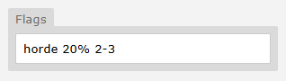

# Horde Battles

## Introduction
As an aspiring Pokemon region developer, you will want to keep up with the latest battling trends. One of the newest battle mechanics which has managed to stick around, are Horde Battles.

As a dev, you have two main ways to implement horde battles.

## Mixed Encounters
Regular grass has a chance to trigger a horde instead of a standard encounter.

- Shares the same encounter pool, rarity and level ranges as your normal wild encounters.

- Good for casually mixing hordes into standard gameplay.

## Dedicated Horde Grass
Use separate grass tiles specifically for horde-only encounters.

- Gives you full control over what Pokémon appear, their levels, rarity, and even specific mechanics.

- Ideal for special zones, unique challenges, post-game content.

Use whichever approach best fits the structure and design of your region.

**Mixed encounter example:**

In this example from Sinnoh, every wild encounter has a **20% chance** to be a horde, consisting of **2 to 3 Pokémon.**

For **dedicated horde grass**, simply create a separate encounter group (e.g. `encounter(horde)`) and use a **100% chance** in the flag to guarantee a horde battle.

!!! warning "Shiny Rolls"

    Each additional Pokémon in a horde increases the number of shiny rolls (i.e. a horde of 5 gives 5 chances per encounter). This massively boosts shiny odds, so hordes larger than 3 should be reserved for **post-game content only.**
    
    Keep horde sizes to a maximum of **3 Pokémon** during the main game.

!!! note "Specific Hordes"

    Pokengine currently doesn’t support specific horde combinations (e.g. one Phantump among a group of Sudowoodo). At the moment, hordes will only ever consist of the same species. This feature is on our roadmap.