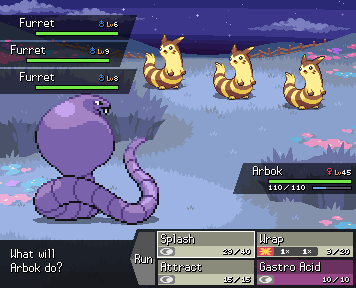
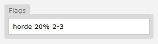
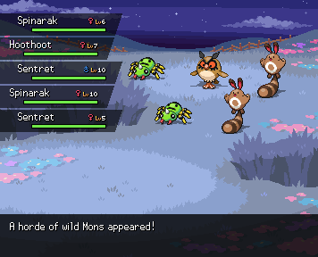
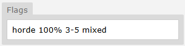

# Horde Battles

## Introduction

A **horde battle** is a way for a trainer to encounter multiple wild mons in a single battle. Such battles can be 1v2, 1v5, or anything in between. 

As a developer, you have multiple ways to implement horde battles. Use whichever approach best fits the structure and design of your region.

## Horde Chance Encounters
Regular grass has a chance to trigger a horde instead of a standard encounter.

- Shares the same encounter pool, rarity and level ranges as your normal wild encounters.

- Good for casually mixing hordes into standard gameplay.

In this example, every wild encounter has a **20% chance** to be a horde, consisting of **2 to 3 Pokémon.** The remaining 80% of battles will be traditional 1v1 single wild battles.

## Dedicated Horde Grass
Use `100%` and separate grass tiles specifically for horde-only encounters.

- Gives you full control over what Pokémon appear, their levels, rarity, and even specific mechanics.

- Ideal for special zones, unique challenges, post-game content.

## Mixed Horde Battles

The species of horde battles can also be intermixed. To do so, use `mixed`

!!! warning "Shiny Rolls"

    Each additional Pokémon in a horde increases the number of shiny rolls (i.e. a horde of 5 gives 5 chances per encounter). This massively boosts shiny odds, so hordes larger than 3 should be reserved for **post-game content only.**
    
    Keep horde sizes to a maximum of **3 Pokémon** during the main game.

!!! note "Specific Hordes"

    Pokengine currently doesn’t support _specific_ horde combinations (e.g. one Phantump among a group of Sudowoodo). This feature is on our roadmap.