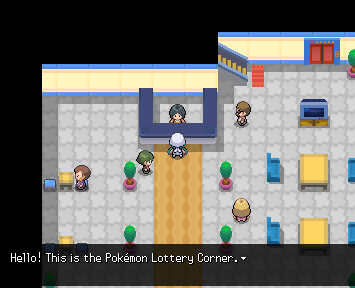
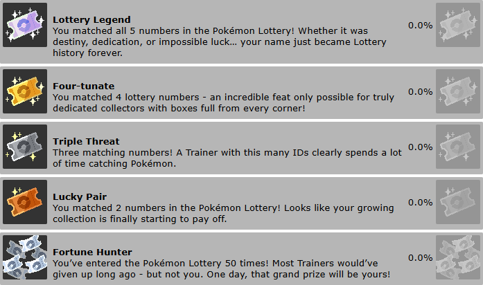

# Lottery Corner System



The Lottery Corner (also known as Loto-Id) system allows players to check a daily or weekly lottery number. If the drawn number matches the UMID number of any Pokémon they have obtained within that region, they can win a prize.
## Activation

To add a Lottery Corner NPC, simply use one of the following commands:

Daily Lottery
```json
msg()lottery=daily
```
Allows players to participate once per (real life) day.

Weekly Lottery
```json
msg()lottery=weekly
```
Allows players to participate once per week. After first use by the player, they will need to wait a week from when they did it.

The system automatically handles:
- All dialogue
- Generating lottery numbers
- preventing duplicate claims
- Checking all eligible pokemon
- Determining highest matching prize tier
- Awarding prizes

No additional scripting is required.

## How Matching Works

The lottery number is a 5-digit number.
The system compares this number against the UMID of every Pokémon obtained within the current region.
Only Pokémon from the current region are eligible. Pokémon originating from other regions will not be considered.
The highest match found determines the prize awarded.

Example:
```json
Lottery Number: 12345
Pokémon UMID:   54345
```
The last three digits match:
```json
345
```
This would award the Second Prize.

## Prize Tiers
🥉 Third Prize - Match the last 2 digits
🥈 Second Prize - Match the last 3 digits
🥇 First Prize - Match the last 4 digits
👑 Jackpot Prize - Match all 5 digits

By default, the rewards are:

🥉 Third Prize - Max Revives
🥈 Second Prize - PP Ups
🥇 First Prize - Lucky Egg
👑 Jackpot Prize - Master Ball

There is no prize for matching 1 digit, as this is too easy to achieve.

## Achievements
Achievements are handled automatically by the system. 
Prize achievements are awarded for each lottery tier, and an additional achievement is granted after entering 50 times, regardless of win or loss.
These achievements are tracked cumulatively across all Regions and are not Region-specific.



💡 **Credit**: The Lottery Corner system was developed by **Skur**.
