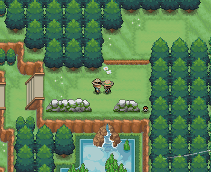
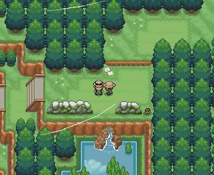
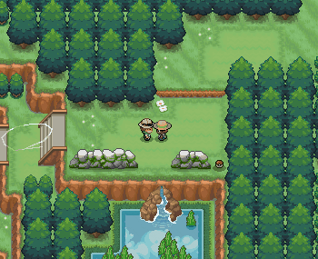
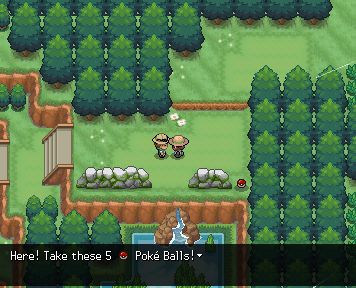
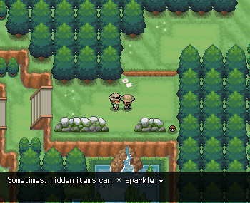

# Msg and Textboxes
## Introduction
Textboxes can be created in two main ways:

- **msg()** – Typically used for NPCs, signs, and standard dialogue interactions.

- **&textbox=** – Used when you want to trigger a textbox externally, such as during a cutscene or scripted event.

While both methods serve similar purposes, there are important differences when using `&textbox=:`

Since it's not wrapped in parentheses, certain symbols (like `|`) can cause issues, as they’re interpreted differently by the engine.

To include a line break, you must use `\|`. A plain `|` will not work.
`execute(freeze&textbox=Where are you going?\|Haha, I'm just kidding! Enjoy your travels, kid)`

In the case above, `\|` ensures the dialogue splits onto two lines properly.

## NPC Nametags
Since this is a 2D top-down pixel art game where characters can’t show much expression, following cutscenes with multiple speaking characters can be tricky. To help, we’ve implemented a nametag system.

`%random%.msg(<name:Lund,255,146,50>Have you managed to collect 10 Cliff Feathers?)`
In this example, the NPC is named `Lund` with an orange nametag color set using the RGB value `255,146,50.` If you omit the color, the nametag will use the default text color.

The nametag will persist throughout the entire speech, so be sure to set a new nametag if another character speaks during the same event. You can also clear the nametag by using `<name:>` with no text.

Unfortunately, the engine doesn’t currently support showing images with nametags, but creative devs like **KingTapir** have found clever workarounds and may offer assistance if you ask nicely.

!!! warning "Accessibility"

    Choose colors carefully to ensure good readability and accessibility for all players.

!!! tip "Nametags"

    Always use nametags for important characters, especially during cutscenes with multiple speakers! Pick a unique color for recurring characters like rivals to help players keep track.

<!-- ================================================================== -->

## Text Alignment

Textboxes and msg are left-aligned by default.
Use the tags in the below example to change alignment:
```json 
msg(<align:center>This text is center aligned)
```
```json 
msg(<align:right>This text is right aligned)
```

!!! note "Persistent Alignment"

    If you don’t close the alignment with `<align:>`, the alignment will persist for all following messages in the same speech.

<!-- ================================================================== -->

## Text Color

The text is white by default.
Use the tags in the below example to change the text color:
```json 
msg(<color:red>This text is red.<color:> This text is white (default).)
```

### Built-In Color Names

| Color Name | RGB Value |
|------------|-----------|
| `black` | 0,0,0 |
| `white` | 255,255,255 |
| `red` | 255,0,0 |
| `green` | 0,255,0 |
| `blue` | 0,0,255 |
| `yellow` | 255,255,0 |
| `cyan` | 0,255,255 |
| `magenta` | 255,0,255 |
| `orange` | 255,165,0 |
| `purple` | 128,0,128 |
| `pink` | 255,192,203 |
| `brown` | 165,42,42 |
| `gray` | 128,128,128 |
| `lime` | 0,255,0 |
| `navy` | 0,0,128 |
| `teal` | 0,128,128 |
| `olive` | 128,128,0 |
| `maroon` | 128,0,0 |
| `indigo` | 75,0,130 |
| `turquoise` | 64,224,208 |
| `beige` | 245,245,220 |
| `gold` | 255,215,0 |
| `silver` | 192,192,192 |

### Custom Colors

You can also define custom colors by specifying the RGB 255 values:
```json 
<color:255,0,0>Red text<color:>
```

<!-- ================================================================== -->

## Pausing

To pause mid-sentence, use
```json 
msg(Hello <wait:2000>there!)
```
where the wait time is specified in ms.



To instead pause at the end of the sentence **and then auto-advance**, you can use
```json 
msg(Hello <hold:2000>there!)
```



<!-- ================================================================== -->

## Speed

The text rendering speed is defined in ms per character. By default, this is 15, but you can change it using
```json 
msg(This is normal speed, <speed:100> this is slow speed, <speed:>#and this is back to normal speed.)
```


| Speed Value | Description                                           |
|-------------|-------------------------------------------------------|
| [empty]     | Resets to normal speed; usage is `<speed:>`           |
| 0           | Instant (discouraged, as instant text can be jarring) |
| <15         | Fast text - recommended value is 5                    |
| 15          | Normal text                                           |
| >15         | Slow text - recommended value is 100                  |

<!-- ================================================================== -->

## Triggers

Sometimes, counting `|` can be exhausting. To instead insert triggers into the text itself, use
```json
<trigger:>
```

This causes the trigger to execute **on the next textbox**. As an example, see:

```json
msg(Hi!<wait:1000>#Hey wait...<trigger:with=%random%&icon=1>|Stop right there!)
```


<!-- ================================================================== -->

## In-Line Symbols (Icons)

By specifying the url, number of animation frames, and position offsets, you can insert icons into the textbox.
```json 
msg(Look at this <icon:url,frames,speed,x,y> icon!)
```

### Static Symbol Example
For a static symbol, use `frames=1`:
```json
%random%=npc(01fz5kw8)
%random%.msg(Here! Take these 5 <icon:https://pokengine.b-cdn.net/play/images/sprites/2156/ow_ball.webp,1,100,0,-2> Poke Balls!)
```


### Animated Symbol Example
```json
%random%=npc(01fz5kw8)
%random%.msg(Sometimes, hidden items can <icon:https://pokengine.b-cdn.net/play/images/sprites/1995/ground-sparkle.webp,15,100,0,0> sparkle!)
```
