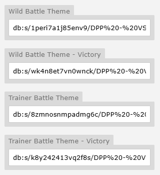
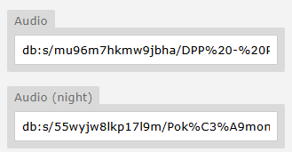
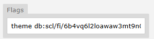

# Music Settings

## Default Battle Themes
To set the default battle music for your region:

- Go to the Region tab in Mapbuilder.

- Enter your desired track in the relevant battle music input fields.



## Setting Music Per Map
If you want a specific map to use a different track:

- Open the map in Mapbuilder.

- Navigate to the Settings tab.

- Scroll down and enter your music file into the Music input field.

!!! note "Night Time Ambience"

    You can optionally set a night version of your track. Most places don’t use this, but it can help add atmosphere in key areas.

!!! note "Night Time Ambience"

    For interiors within a town (e.g. houses), you should usually use the same music as the town itself - unless it’s a unique location.

!!! tips "Kyledove's Tip"

    When multiple maps share the same music track, the engine will seamlessly continue the song as the player moves between them - no restart! Super clean.



## Triggering Music via jCoad

Please see the following example from Sinnoh Region:

```json 
%random%=npc(01k86ru4,down)if !beaten
%random%.spot(6)&track=db:s/brm2ibkabxai4t5/Look%21%20Shorts%20Boy.mp3
%random%.msg(You're a Pokemon Trainer, and so am I!|Our eyes met, so battle we must!)|&battle=613;
else
%random%.msg(Don't be shy about talking to Trainers you'd like to battle.|Pokemon grow stronger and stronger from battling.)
```

You can use this as a separate trigger anywhere - not just when a trainer spots the player. For example, it’s useful during cutscenes if you want to change the music after a specific event occurs.

`&track=db:s/brm2ibkabxai4t5/Look%21%20Shorts%20Boy.mp3`

## Setting a Song for Specific Trainer Battles

1. **Set it directly in the Trainer Battle Data Context Menu**
    Simply input the desired music track in the designated **Theme** field of the trainer's data.
    

2. **Set it manually via jCoad**
    Trigger the battle with a custom theme like so:
    `battle=843;theme db:s/wo28e1a78gcfg35/Seth%20Theme.mp3`

!!! note "Overrides"

    Any time you set music via jcoad or directly in the Trainer Battle Data, it will automatically override whatever is set in your Region settings. Simple!

