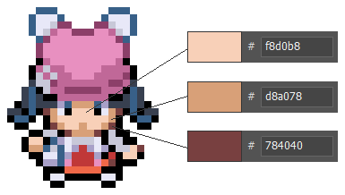

# Outfit System

To enhance player immersion in the world and its stories, players can take on the roles of a diverse range of characters.
Pokengine doesn’t natively support customization options like hats, hairstyles, torsos, or legs. Since we only host Gen 1, 3, and 4 overworld sprites, implementing such features would be extremely difficult - especially within such a small canvas, where the changes wouldn’t be different enough to be worth the effort.

Instead, we allow players to completely change their character. We call these skins or outfits.
This doesn’t mean we’re limited - there are over 1,000 potential unique trainers in the database.

!!! warning "Be Careful"

    Please be very careful when using skin and outfit in your code. They have different functions, and mixing them up can cause all manner of issues. Double-check your usage to avoid unintended behavior.

## Skin Tones

We also support the ability to change skin tone. This can be done via the settings in-game, as long as the base overworld sprites use the exact color values. From lightest to darkest, these are: `#f8d0b8`, `#d8a078`, and `#784040`.



**Not every obtainable skin will function with this system.**

## Changing Skin

`%random%.msg(After this sentence, you will change into Lux from Sinnoh!)&outfit=01tztoy0`

Use `&outfit=` to force a player to change their skin. This doesn’t have to be triggered by an NPC - you can also put it on an ontile or execute when a player starts your region, ensuring they begin with the appropriate skin already applied.

## Unlocking skins in-game

`%random%.msg(Bravo! I say, bravo!|To get you started, here's two complimentary outfits from me!|Enjoy, and build your collection!)&|skin=01fb21pn&skin=01hsly3h`

As you can see, you can use `&skin=UID` to grant skins to players. This command adds the skin to the player’s global collection of skins, which can then be accessed either via the Outfit Bag item or in a Changing Room.

Skins are global and not restricted by GPC. This means any skin obtained in one region can be used in any other region, as long as there’s a system in place (like a changing room or outfit bag) that allows players to switch skins.

## Silent Skin Unlock

`&skin=01tztoy0,silent`
Add ,silent to the end of the skin command to grant a skin without triggering a dialogue box on screen. This is especially useful for seamless scenarios like cutscenes or intros where you don’t want to interrupt the flow with a message.

!!! warning "Skin Coordination"

    When distributing “Trainer Class” skins, please coordinate with the admins to minimize overlap. Spreading skins across different regions helps keep the experience fresh and enjoyable for players. Also, when you grant any skins, please remember to add the #obtainable tag on the site so players can easily find trainers available through gameplay via searching “trainers #obtainable”.

## Ability to change skin

There are two main methods for players to change skins within regions:

**Changing Room**

```json
%random%=npc(sprites/1995/empty,down)
%random%.shadow()
%random%.msg(Would you like to use the fitting room?)&answers=Yes,No
Yes=%random%.answer()&outfits
No=%random%.answer()
```

You can place a fitting or changing room on a map, similar to how Pokémon XY implements it. When players interact with these locations, they are given the option to change their outfit. This method is ideal if you want to control how often and where players can switch skins - especially if what skin you wear has a wider effect on your region.

**Outfit Bag**

`&item=0698kwc5`

Simply give players the Outfit Bag item, and they’ll be able to change skins on the fly, anywhere.

**Custom Methods**

`&outfits`

You can create your own method for changing skins - for example, a unique character who loves giving makeovers. All you need is &outfits.
However, we generally recommend sticking to the two established methods (Changing Room and Outfit Bag) for consistency across regions. Players will already be familiar with those, making the experience smoother and more intuitive.

!!! info "Not Mandatory"

    Using any method to enable skin changes is optional. If your region has a very bespoke story where the player’s character identity is important, you may want to restrict or delay this ability until after the main story is completed.

## Using Outfits to Affect Gameplay

```json
if outfit=01z9igq4 or outfit=01tztoy0
msg(...You again?|Let’s battle!)
else
msg(%player%, is that you?|Something seems different about you…|Anyway...|Let’s Battle!)
```

In this example, the NPC’s response changes based on the player’s current outfit. If the player is wearing one of the starting skins, the NPC recognizes them as usual. However, if the player has changed to a different skin, the NPC notices the difference.

This is a simple demonstration of how the player’s outfit can influence dialogue or gameplay. You can expand on this concept to create richer, more dynamic interactions based on the skin the player is wearing.

**For example, the skin you wear could affect:**

**Different Wild Encounters**

Certain outfits might attract specific Pokémon in grass or other environments.

**Stealth Mechanics**

Wearing stealthy attire could make it harder for NPCs to spot you or reduce the number of wild Pokémon encounters.

**Faction Disguises**

If you’re disguised as a member of a faction or team (like Team Rocket), you might be able to infiltrate restricted zones or unlock special dialogue.

**NPC Reactions & Reputation**

Could affect how NPCs treat the player - friendly, hostile, or neutral reactions depending on what they’re wearing.

**Quest Triggers**

Wearing specific outfits could unlock unique quests or dialogue options that aren’t available otherwise.

**Access Restrictions**
Some outfits might act as “keys” to restricted areas - e.g., a lab coat grants access to a research facility, or a snobby concierge won’t let you into their high class establishment unless you’re dressed for the occasion.

**Puzzle Mechanics**
Certain outfits might be required to solve environmental puzzles - like a diving suit for underwater areas.

**Event Participation**
Specific outfits could be required or unlock special participation in seasonal events or festivals.

**Enhanced Abilities** - <span style="color:red">*anything in red is not currently possible*</span>

Wearing particular outfits could grant temporary stat boosts or unique abilities, such as increased speed, <span style="color:red">improved egg hatching, improved exp gain, improved happiness gain, improved catch rates, </span>or practical benefits like a farmer outfit <span style="color:red">boosting berry growth rates</span> or a haggler outfit giving you <span style="color:red">shop discounts.</span>


## Restricting outfit choices
Gen 1-style games host their own separate list of skins, kept distinct from non-retro skins. This prevents players from turning into Gen 1-style characters when playing in a Gen 4 region and vice versa, maintaining visual consistency.

You can also use a region var to restrict outfits solely to skins that are assigned to the region you’re in as below. This is used in Retro Hoenn to ensure only Retro Hoenn suitable skins can be selected.

Note that if you use this, any skins you obtain within your region will still be available outside of your region.

var[regional_outfits]=1

## Buying Outfits in-game

Please refer to Shop System page
