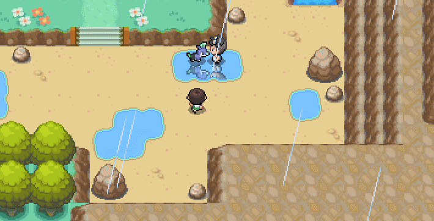
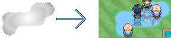
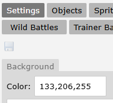
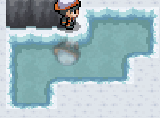

# Reflection System

{width=50%}

## Activation

To activate the reflection system, either:

<u>1. Create a reflection sprite</u> on the `reflection` layer of the game to act as a mask. This can be done via, e.g.,

    `%random%=sprite(186753/test-reflection-single,reflection)`.

   

   - The mask will show reflections where pixels are white.
   - The mask respects alpha.
   - There can only be one mask active at a time. This is a restriction of the built-in PIXI sprite class.
   - If the sprite is the same size as the map it's placed upon, it will automatically align itself with the map. This allows you to create a single sprite for an entire map. Note that this may create a `.png` that's quite large, but you can use png optimization tools, such as TinyPNG.com or create one yourself in, e.g., Python.

!!! tips "Kyledove’s Tip"

     Set the sprite's layer to `map` first to align it.

<u>2. Set `mapvar[reflections_void]=1`</u>. This allows reflections to appear on the `void` layer of the game.

   - If you do this, it's also recommended to change the void color to `133,206,255`:

     

## Customizations

### Gen 3 Filter

`mapvar[reflections_gen3]=1`

### Frosted Ice

`mapvar[reflections_frosted]=1`

💡 **Credit**: The Reflection system was developed by **Ginzuishou**, **Kyledove**, and **JosiahKunz**.