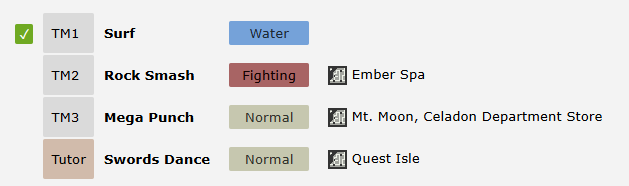

# Region TMs and Tutors
For the player’s convenience, we support displaying a list of TMs and Tutors for each region directly on the site.
For example: Retro Kanto TM List https://pokengine.org/regions/035prupq/Retro+Kanto?tmlist

Unfortunately, this list has to be populated manually - the engine doesn’t automatically know which TMs or Tutors are available in your region.
The good news is that it’s easy to set up.

To add or update your list:

1. Go to your region’s page (or one you have access to).

2. Click the Edit button in the top-right corner.

**Here’s a syntax example:**
```json
Surf (07gsqbyv)
Rock Smash (07o2l9wt) - Ember Spa (08661io6)
Mega Punch (07q6r5hl) - Mt. Moon (08u5jkcg) - Celadon Department Store (08o6kbnt)
tutor - Swords Dance (07a4uh4j) - Quest Isle (08zyj5du)
```

!!! info "Entry Ease"

    When first filling it out, you can write it quickly as just 07o2l9wt - 08u5jkcg, 08o6kbnt

The result would look as follows on site;



As you can see, you can leave the **map location** blank if you want - for example, if a TM isn’t obtainable yet but you still want players to know it exists for future use.
You can also list **multiple locations** for the same TM, as shown in the third example.
For **Tutors**, they’ll automatically be sorted to the **end** of the TM list.

!!! note "Extra Functions"

    :white_check_mark: A green tick will appear next to any TMs the player has already obtained. (Please note, that this doesn't apply to Tutors.)

Players can **click the move name** or the **map location** to jump directly to that page - wow! The system will auto-number them (e.g. "TM23") but these numbers don’t have any built-in meaning.

!!! note "HMs and TMs"

    Pokengine doesn’t currently differentiate between TMs and HMs - so moves like Surf will still be shown as TMs here and in-game.

!!! tips "Kyledove's Tip"

    Personally, I recommend listing your TMs in the order they’re likely to be obtained. 
    As a player, I find it helpful to see the green tick gradually move down the list - it gives a sense of progress and makes it easier to track what I’ve missed. It also helps indicate how early or late in the game a TM becomes available.

!!! tips "Kyledove's Tip"

    Currently, users need to check each region’s page to see which TMs or Tutors are available. In the future, we’d like to improve this by showing a list of regions directly on each move’s page - similar to how Pokémon pages let you check which maps they appear on.


