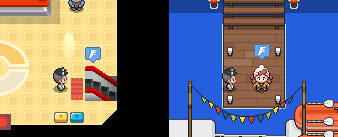

# Region Travel

## Introduction
It’s extremely important to consider how players can leave your Region.
We recommend enabling travel through your Pokémon Centers – this is the most common approach across Regions and feels familiar and intuitive for players. One of the most frequent questions we receive is: “How do I leave [Region Name]?”

**Possible methods:**

- Add an upstairs or downstairs area in your Pokémon Center with a travel option

- Attach a metro station to your Pokémon Center (like Ishiria does)

- Place an air taxi station next to your Pokémon Center

- Include a clearly marked phone inside that players can use to call an air taxi
Some regions like Rica for example have sailors at ports you can use, so it’s up to you.

## Flight Icon



We kindly request that you use the flight icon to help users easily identify a global indicator for where to travel from.

**Travel icon with NPC:**

```json
%random%=npc(01l12eie,down)
%random%.icon(30,1)
```

**Travel icon without NPC:**

```json
%random%=npc(sprites/1995/empty)
%random%.shadow(0)
%random%.icon(30,1)
```

**Travel Desk Example:**

```json
msg(Welcome to the Travel Center.|Would you like to travel to another region?)|&answers=Yes,No
Yes=answer(Have a good trip!)&travel=checkpoint
No=answer(Please enjoy your stay in the Sinnoh Region!)
xy(0,16)
spawn(travel,down)
```
!!! note "Spawn Points"

    This object includes the spawn point. Using an XY offset, you can position the spawn point a tile below the object. This is handy because it allows you to use a single root object for all your travel counters.

## Travel Checkpoints

As a player, you don’t want to be sent back to the start of a Region every time you visit. To solve this, we use a checkpoint system that remembers the last place you traveled from and returns you to that same spot when you come back. You can see this in action above with &travel=checkpoint and spawn(travel).

Some Regions, like Rica, don’t use checkpoints. Instead, when you travel there, you’re given a list of locations to choose from. Ultimately, it’s up to you how you want to handle it. Generally, this method can be trickier because you’ll need to track whether the player has visited each location, and the list will grow as the journey progresses.