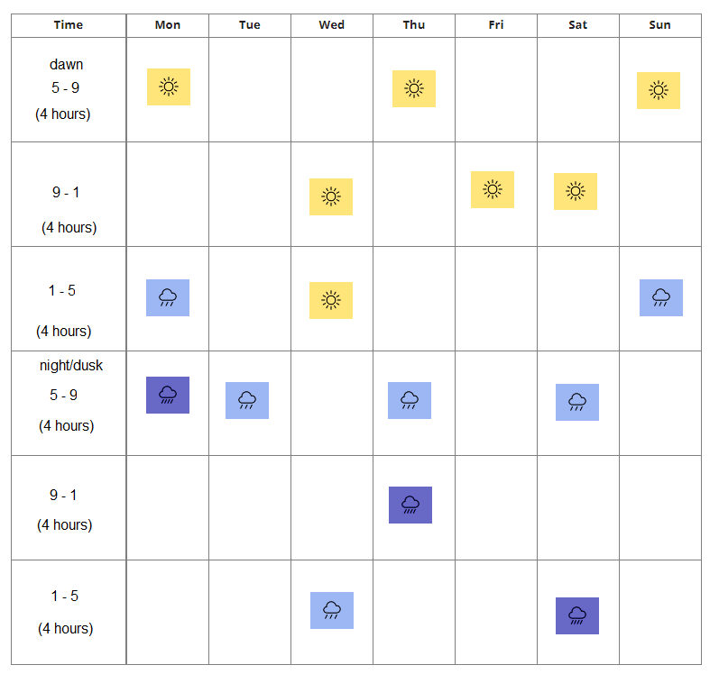

# Kyledove's Regional Weather Scheduling

## Basic Map Weather Setup

As you might know, Pokengine allows you to set weather per map using the following input format:


```
clear:40 snow:50 blizzard:10
```

This system works by rolling the weather once per in-game hour, based on the probabilities you provide.

However, there are a couple of caveats:

- Weather is client-side, so different players may see different weather on the same map at the same time.

- Each map rolls independently, which can lead to abrupt transitions – like moving from rain to snow to sun in just a few steps. This can feel jarring and break immersion.

## Regional Weather System (by Kyledove)

To avoid jarring transitions, Kyledove devised his own **regional weather system**, which lets you control weather consistently across your whole region and is the same for all players.

### Example Schedule Script

```
if day=monday
if hour>=0 and hour<7 and mapvar[weather]!=1
execute(weather=clear&mapvar[weather]=1)
else if hour>=7 and hour<9 and mapvar[weather]!=2
execute(weather=harshsunlight&mapvar[weather]=2)
else if hour>=9 and hour<13 and mapvar[weather]!=3
execute(weather=clear&mapvar[weather]=3)
else if hour>=13 and hour<17 and mapvar[weather]!=4
execute(weather=rain&mapvar[weather]=4)
else if hour>=17 and hour<21 and mapvar[weather]!=5
execute(weather=downpour&mapvar[weather]=5)
else if hour>=21 and mapvar[weather]!=6
execute(weather=clear&mapvar[weather]=6)

if day=tuesday
if (hour>=17 and hour<21) and mapvar[weather]!=1
execute(weather=rain&mapvar[weather]=1)
else if (hour<17 or hour>20) and mapvar[weather]!=2
execute(weather=clear&mapvar[weather]=2)

if day=wednesday
if hour>=0 and hour<5 and mapvar[weather]!=4
execute(weather=rain&mapvar[weather]=4)
else if hour>=5 and hour<9 and mapvar[weather]!=1
execute(weather=clear&mapvar[weather]=1)
else if hour>=9 and hour<17 and mapvar[weather]!=2
execute(weather=harshsunlight&mapvar[weather]=2)
else if hour>=17 and mapvar[weather]!=3
execute(weather=clear&mapvar[weather]=3)

if day=thursday 
if hour>=0 and hour<7 and mapvar[weather]!=5
execute(weather=clear&mapvar[weather]=5)
else if hour>=7 and hour<9 and mapvar[weather]!=1
execute(weather=harshsunlight&mapvar[weather]=1)
else if hour>=9 and hour<17 and mapvar[weather]!=2
execute(weather=clear&mapvar[weather]=2)
else if hour>=17 and hour<21 and mapvar[weather]!=3
execute(weather=rain&mapvar[weather]=3)
else if hour>=21 and mapvar[weather]!=4
execute(weather=downpour&mapvar[weather]=4)

if day=friday
if hour>=7 and hour<13 and mapvar[weather]!=1
execute(weather=harshsunlight&mapvar[weather]=1)
else if hour>=13 and hour<=23 and mapvar[weather]!=2
execute(weather=clear&mapvar[weather]=2)
else if hour>=0 and hour<7 and mapvar[weather]!=3
execute(weather=clear&mapvar[weather]=3)

if day=saturday
if hour>=0 and hour<9 and mapvar[weather]!=4
execute(weather=downpour&mapvar[weather]=4)
else if hour>=9 and hour<13 and mapvar[weather]!=1
execute(weather=harshsunlight&mapvar[weather]=1)
else if hour>=13 and hour<17 and mapvar[weather]!=2
execute(weather=clear&mapvar[weather]=2)
else if hour>=17 and mapvar[weather]!=3
execute(weather=rain&mapvar[weather]=3)

if day=sunday
if hour>=0 and hour<6 and mapvar[weather]!=1
execute(weather=clear&mapvar[weather]=1)
else if hour>=6 and hour<9 and mapvar[weather]!=2
execute(weather=harshsunlight&mapvar[weather]=2)
else if hour>=9 and hour<13 and mapvar[weather]!=3
execute(weather=clear&mapvar[weather]=3)
else if hour>=13 and hour<17 and mapvar[weather]!=4
execute(weather=rain&mapvar[weather]=4)
else if hour>=17 and mapvar[weather]!=5
execute(weather=clear&mapvar[weather]=5)
```

!!! note
    Simply create your own root object (please don’t copy Kyledove’s weather schedule), and place it in each exterior map.

!!! warning
    It is not recommended to use **harsh sunlight** during night or dusk hours – it feels very unnatural and out of place.

In this system, each in-game day is divided into **4-hour intervals**, which Kyledove found to be the sweet spot – long enough to feel meaningful, but short enough to keep things dynamic without dragging on.

!!! danger
    If you use this system, you **must** set each map’s weather input to `none`.  
    Failing to do so will cause weather bugs (such as persistent or conflicting weather conditions across maps).

!!! tip "Kyledove’s Tip"
    You can pair this system with conditional logic to create weather-based gameplay variation. For example:

    ```
    if weather=rain
    encounter(grass-rain)
    else if weather=harshsunlight
    encounter(grass-sunny)
    else
    encounter(grass)
    ```

    This can be used to:
    - Adjust wild encounters based on the current weather

    - Add weather-specific NPCs (e.g. a parasol lady who only appears in rain)
    
    - Make routes feel more alive and variable across playthroughs

    Used well, it creates a more immersive and replayable experience for players – where there’s always something new to discover.

---

This results in the following weather forecast:
