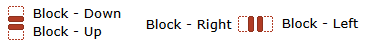
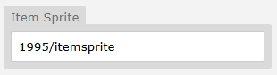

# Root Objects
## Introduction - What are Root Objects?
Mapbuilder includes a set of pre-made “default objects” that you can easily drop into your maps - no jcoad knowledge required!
You can access them via `Objects > Default`.

Important: 

!!! info "Learn from examples"

    Default objects are just regular objects with pre-written code. It’s a good idea to open them up and check how they work - you can reuse or modify the same code in your own custom objects.

## Solid Blocks
Use these to block off tiles the player shouldn't be able to walk into.

- Comes in red (default) and green (useful if your map is already red-heavy to improve visibility)

- You can also set one-way solid blocks (e.g. block from left, but not from right)

!!! warning "One Way Solids"

    If you're using one-way solids, you'll likely need to pair two together to fully prevent unintended entry paths.

**Example of One Way Solid Root Objects**



!!! warning "With great engines, comes greater control of passability"

    Unlike RPG Maker / RMXP, tilesets in Pokengine don’t have built-in passability. You must manually place blocks for each map.

## Encounters
Setting different types of encounters of a block can be useful to change Pokemon encounters across different terrain types.

- Encounter - Grass: Avoid using this. You’ll usually want to create your own grass objects to match your Region.

- Encounters - None: Can be useful on maps with global encounter logic (e.g. caves or forests).

## Items
Use these to place one-time item pickups on maps.

- Default item objects are just icons — they don’t contain any logic.

- You’ll need to pair them with code like this:
```json
item(06a1u97i)
item(06a1u97i,hidden)
```
This creates a visible and hidden potion item (replace the UID with the one from the site).

!!! tip "Default Image Change"

    You can set a default image for items in Region > [Your Region] using the image path input.



**Recommended:** `1995/itemsprite` (standard Gen 4-style item sprite), but you can use any sprite you like.

## Ledges
Let players jump in one direction but prevent them from returning the same way. Simple to use - just place them where needed.

NPC
 Another default object type that doesn’t include any built-in code - it’s purely for organization.

- NPC - Regular: A standard NPC

- NPC - Battle: An NPC that initiates a trainer battle

- NPC - Pokémon: A Pokémon as an NPC

You’ll need to add your own code to each one. See NPC code elsewhere in the guide for examples and setup instructions.