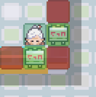

# Shop System

To create a shop, use msg() for the dialogue, followed by &shop= and a list of item uids:

`msg(Welcome!#What do you need?)&shop=06xa6ohm,06a1u97i,06qqcmyo,06vfln35`

This seller sells Poké Ball, Potion, Antidote, Paralyze Heal

It is strongly recommended to create **root objects** for your shop code to improve efficiency. Without this, any changes you want to make later will require editing every single shop instance individually. With a root object, you only need to update the code once - then simply recompile your maps, and all shops will update automatically. Neat!
A player’s in-game currency is tied strictly to the region they’re currently in. Money cannot be transferred between regions or across players.

!!! note "Comments are useful!"

    We know using item UIDs instead of names isn't ideal. It makes the code harder to read and it's not clear what each UID refers to. To help with this, feel free to add comments in your code like: `//Poke Ball`

## Selling Player-Owned Items
The shop system will, by default, include both **Buy** and **Sell** options.

Players can sell most items they own, **except** those in the **Key Item** and **TM pockets** - these cannot be sold under any circumstance.

## Item Pricing and Best Practices

Prices for items are set at a **global level**, and by default, the **sell price is automatically half the buy price.**

If needed, you can override the buy price like this:

`&shop=06xa6ohm:150`

In this example, although Poké Balls are normally **200**, this sets the price to **150** instead.

!!! warning "Money Exploits"

    We strongly recommend against overriding item prices unless absolutely necessary. The sell price remains hardcoded - so if you set a Poké Ball’s price at 50 (instead of the normal 200), a player could then sell it back for 100 and effectively double their money. This creates a potential infinite money exploit that players could abuse.

## Advanced Shop Code Example



### NPC Setup
```json
martguy=npc(01xorygm,right)
```

### Msg Object (Below NPC)
```json
msg(Welcome!#What do you need?)!with=martguy&!direction=d&!lookat=80,96&shop=06xa6ohm,06a1u97i,06qqcmyo,06vfln35&lookat
```

### Msg Object (To the Right of NPC)
```json
msg(Welcome!#What do you need?)!with=martguy&!direction=r&!lookat=80,96&shop=06xa6ohm,06a1u97i,06qqcmyo,06vfln35&lookat
```

**Two Interaction Points:**

This example uses two separate message objects to trigger the shop, depending on which tile the player interacts from.

**Facing the Player:** 

The !with=martguy flag tells the NPC (named martguy) to face the player before the message plays. The ! prefix ensures this happens before the message.

**Camera Adjustment:**

lookat=80,96 shifts the camera view slightly, preventing the player from being covered by the shop UI. The second lookat resets the view once the shop closes.

**Shop System That Grows With Progress**
When developing a traditional region, it’s a good idea to set up your Poké Marts so that their inventory expands as the player progresses.

For example, after each gym badge or key milestone, you can add better items to all your shops. This prevents players from needing to backtrack to late-game areas just to buy useful items.

```json
if badge[8]
msg(Welcome!#What do you need?)&shop=06xa6ohm,06idcypk,061wi1pj,06a1u97i,06a8ya3p,066h5wnp,068v4pbn,06nsq383,06419qe1,06qr8fas,06smqv1x,067ckuir,06qqcmyo,06vfln35,06z3f6w6,066m758u,06uwtfee,06jq3b1m,06qi3v43,06wv2ql3
else if badge[7]
msg(Welcome!#What do you need?)&shop=06xa6ohm,06idcypk,061wi1pj,06a1u97i,06a8ya3p,066h5wnp,068v4pbn,06nsq383,06419qe1,06qr8fas,06smqv1x,067ckuir,06qqcmyo,06vfln35,06z3f6w6,066m758u,06uwtfee,06qi3v43,06wv2ql3
else if badge[6]
msg(Welcome!#What do you need?)&shop=06xa6ohm,06idcypk,061wi1pj,06a1u97i,06a8ya3p,066h5wnp,06nsq383,06419qe1,06qr8fas,067ckuir,06qqcmyo,06vfln35,06z3f6w6,066m758u,06uwtfee,06qi3v43,06wv2ql3
else if badge[5]
msg(Welcome!#What do you need?)&shop=06xa6ohm,06idcypk,061wi1pj,06a1u97i,06a8ya3p,066h5wnp,06nsq383,06419qe1,06qr8fas,067ckuir,06qqcmyo,06vfln35,06z3f6w6,066m758u,06qi3v43,06wv2ql3
else if badge[4]
msg(Welcome!#What do you need?)&shop=06xa6ohm,06idcypk,06a1u97i,06a8ya3p,066h5wnp,06nsq383,06419qe1,06qr8fas,067ckuir,06qqcmyo,06vfln35,06z3f6w6,066m758u,06qi3v43,06wv2ql3
else if badge[3]
msg(Welcome!#What do you need?)&shop=06xa6ohm,06idcypk,06a1u97i,06a8ya3p,06nsq383,06419qe1,06qr8fas,067ckuir,06qqcmyo,06vfln35,06z3f6w6,066m758u,06qi3v43,06wv2ql3
else if badge[2]
msg(Welcome!#What do you need?)&shop=06xa6ohm,06idcypk,06a1u97i,06a8ya3p,06419qe1,067ckuir,06qqcmyo,06vfln35,06z3f6w6,066m758u,06qi3v43,06wv2ql3
else if badge[1]
msg(Welcome!#What do you need?)&shop=06xa6ohm,06idcypk,06a1u97i,06a8ya3p,06419qe1,067ckuir,06qqcmyo,06vfln35,06z3f6w6,066m758u,06qi3v43
else if party>=1
msg(Welcome!#What do you need?)&shop=06xa6ohm,06a1u97i,06qqcmyo,06vfln35
else
msg(Welcome!#What do you need?)&shop=06a1u97i,06qqcmyo,06vfln35
```

The example above is from the Sinnoh Region. It first checks if the player has 8 badges, and if so, presents the full expanded shop inventory. If not, it checks for 7 badges, then 6, and so on. It even checks whether the player has any Pokémon at all.
Of course, you can use a different if condition instead of badge checks - for example, `if ev[beaten-first-boss]=1`. This is especially useful for regions without a traditional Pokémon League, where progression is tracked through custom events instead of gym badges.

!!! warning "Badge Data"

    Badge data must be properly set up for your region in order for the badge example to function correctly.


## Shop System Using Alternative Currencies

You aren’t limited to just money as currency - you can use other variables like BP (Battle Points), EVs, or even specific items as alternative currencies in your shop system!

### Using EVs as currency

`msg(Welcome!#What do you need?)&buy[BP]=065cdb7m:32,068c8flh:32`

In this example, the shop offers Kings Rock and Metal Coat for 32 BP each. Since items don’t have a default BP price, you must set the price manually like this. The player’s BP is tracked via an `ev[BP]` variable, which you can increase as the player earns Battle Points.

This system isn’t limited to just BP - you can use any variable-based currency that can go up or down. Examples include Game Corner coins, fishing tournament points, arcade tickets, clan emblems, seasonal event tokens, etc. It’s a flexible setup ideal for reward shops, limited-time events, or activity-based progression.

!!! note "EV Visibility"

    When using a system like this, players cannot see their current ev[] values directly. Be sure to include an NPC or function that clearly displays the player's current point balance.

### Using Items as currency

`msg(Welcome!#What do you need?)&buy[06se46p3]=065cdb7m:5,068c8flh:10`

Instead of using an `ev[]` variable, you can use an item as currency. In this example, trash `06se46p3` is being used as currency - ideal for rewarding players who do a lot of fishing.

This method is great when players naturally accumulate large quantities of a specific item in your region. It also works well in seasonal events or mini-regions that focus on resource gathering. For instance, in a region centered around collecting lumber or minerals, players could trade those items for rewards.

### Buying Outfits/Skins
The shop system is currently **not compatible with outfits/skins**, though support for this is on our roadmap.

For now, if you want to allow players to buy outfits, you'll need to code the interaction manually. 

```json
if money<300
msg(Are you interested in buying something new for your wardrobe?#300$ each.|But you don't have enough money!)
else
msg(Are you interested in buying something new for your wardrobe?#300$ each.)&answers=Cool,Athletic,Popular,Cute,No Thanks
Cool=answer(Here you go!)&money=-300&skin=01cqurp9
Athletic=answer(Here you go!)&money=-300&skin=01bqh7e3
Popular=answer(Here you go!)&money=-300&skin=010z5ner
Cute=answer(Here you go!)&money=-300&skin=01su9fps
No Thanks=answer(Come back again!)
```

As you can see, there are several reasons this method isn’t ideal. You’ll need to manually check if the player has enough money, deduct the correct amount upon purchase, and handle all the logic yourself. Additionally, there’s **no way for players to preview the outfit** beforehand.