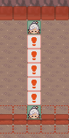
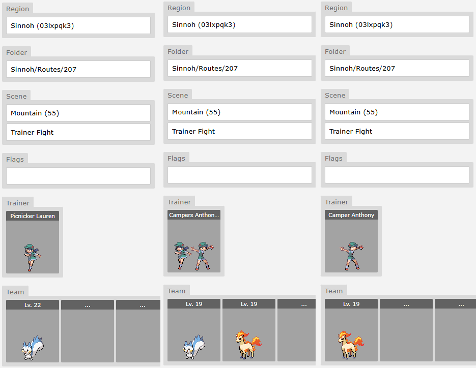
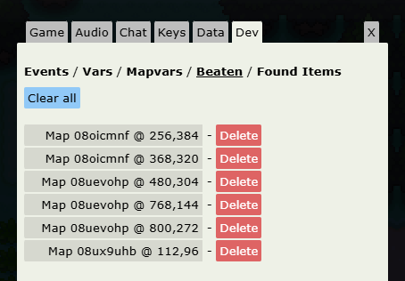
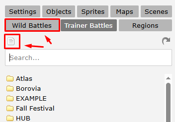

# Trainer Battles

**Navigate to your map:**
**`MapBuilder > [Your Map] > Objects > Default > NPCs > "NPC - Battle!`**

You can use any object you want, but we recommend using **NPC - Battle** to stay consistent with other devs and improve visibility.

## Basic Trainer Battle

```json
%random%=npc(01k86ru4,down)
if !beaten
%random%.spot(6)
%random%.msg(You're a Pokemon Trainer, and so am I!|Our eyes met, so battle we must!)|&battle=613;
else
%random%.msg(Don't be shy about talking to Trainers you'd like to battle.|Pokemon grow stronger and stronger from battling.)
```
The code above, can be broken down into the following constituents:

**npc(uid, direction)**
: Spawns an NPC using the specified UID: `01k86ru4`, which is the DPP Youngster and the NPC is facing down.

**if !beaten**
: Checks if the trainer has not been defeated yet.

**spot(distance)**
: The NPC can detect the player from 6 tiles away.

**msg(...)|&battle=613;**
: The NPC delivers a message when the player is spotted. The `&battle=613;` trigger starts a trainer battle. Battle ID `613` must match an entry in the *Trainer Battles* tab (More on this lower down).

**else block**
If the trainer has already been beaten, they say a different message instead.

## Advanced Trainer Battles
For trainers like **Joggers** who run around, you can add movement and speed behavior. Place something like this **before** the `if !beaten` block:

`%random%.path(9r,4u,4d,9l*)`
`%random%.speed(150)`

### Double & Triple Battles (One NPC)
To set up a double battle with one trainer, simply add `;double` to the end of your `&battle=` line:

`&battle=1993;double`

This makes both sides send out **two Pokémon at once.**

Ensure your trainer battle data (in the Trainer Battles tab) is configured with two usable Pokémon.

For triple battles, use `;triple.`

### Double Battles (Two NPCs)

For trainer duos like **Twins**, **Young Couples**, or **Teammates**, etc.

```json
%random%=npc(01t9jg8b,down)
if !beaten[672,96] and !beaten[688,96]
%random%.spot(3,0,0,0)
%random%.msg(Anna: I'm with my pretty junior student partner. I have to do good!)&battle=1993;double
else
%random%.msg(Anna: Your Pokemon have some good combinations.|I'd say you're second only to us!)
```

**In a separate object**

```json
%random%=npc(01t9jg8b,down)
if !beaten[672,96] and !beaten[688,96]
%random%.spot(3,0,0,0)
%random%.msg(Meg: I'm going to tag up with my super senior study partner and beat you!)&battle=1993;double
else
%random%.msg(Meg: I dragged Anna down...#If I didn't, she would have won!)
```

It’s crucial to include the coordinates of both trainers in the `beaten[...]` condition to make sure the battle only triggers once. You can find these coordinates by hovering over their tiles in MapBuilder - the coordinates appear in the bottom-left corner. 
Also, use `spot(3,0,0,0)` to keep the trainers from moving apart when they spot the player, so they stay together as a pair.

!!! note "Combining Trainers"

    The engine can’t combine two separate trainers into one battle automatically. You need to use or create a single trainer entry that already includes both sprites, prize money, AI behavior, etc. You can search for existing double battle trainers using the query **“trainers #double+battle”**

## Single Battle with Potential to Fuse into a Double Battle

!!! tip "Kyledove's Tip"

    **I do *not* recommend** implementing this under the current system unless absolutely necessary. While it's technically possible, the process is very tedious and laborious.

This setup allows two NPC trainers to engage the player in **separate single battles** or **combine into a double battle** if triggered simultaneously. Due to engine limitations, the fusion logic requires significant manual setup, especially for pathing and event scripting.



### System Steps

#### Step 1: Set Up Individual Trainers

Create your two NPC trainers as normal, with unique IDs and assigned battle IDs for their **single battles.**

**Example of Top NPC**

```json
top=npc(011szhnf,down)
if !beaten[1024,144] and !beaten[1024,96] and !beaten[1024,192]
top.spot(5)
top.msg(Go do it, my Pokemon!#I'll work hard, too!)&battle=645
else
top.msg(I think we'll visit the TV station in Jubilife City next.|Or maybe we should go to the Global Terminal?)
```

**Example of Bottom NPC**

```json
bottom=npc(017505nk,up)
if !beaten[1024,144] and !beaten[1024,96] and !beaten[1024,192]
bottom.spot(5)
bottom.msg(Go for it, my Pokemon!#I'll do my best, too!)&battle=644
else
bottom.msg(Dig for Fossils in the Underground.|The mining museum might be able to bring back the ancient Pokemon!)
```

!!! note "Kyledove's Tip"

    Each trainer must be given a unique name (like top and bottom) – you cannot use `%random%`, as external event objects reference them directly.

#### Step 2: Create Ontile Triggers for Every Tile Between

For each tile where a double battle could potentially be triggered, you need an `ontile` event. Each one must be manually customized based on the player’s location and the NPCs’ distance to that tile.

```json
if ontile and !beaten[1024,144] and !beaten[1024,96] and !beaten[1024,192]
execute(freeze&with=top&icon=1&with=bottom&icon=1&pause=1000&with=bottom&path=2u&with=top&path=2d&pause=1000&with&direction=d&textbox=Go for it, my Pokemon!#I'll do my best, too!<trigger:direction=u>&textbox=Go do it, my Pokemon!#I'll work hard, too!<trigger:battle=670;double>)
```

**Each `ontile` must:

- Use a **unique** path for each NPC depending on the distance from their current position to the triggering tile.

- Check that **none** of the single or double battles have been completed using `!beaten[map,x,y]`.

#### Step 3: Define All Battle Data

You need to create three separate sets of trainer data:

1. Single Battle for the Top NPC
2. Single Battle for the Bottom NPC
3. Double Battle featuring both trainers



#### Final Notes

1. Every tile where the player might trigger both NPCs must have its **own custom event.**
2. Path lengths and movement directions must be manually tuned per tile.
3. There's no shortcut for handling NPC references or condition checks – all logic must be explicitly written.
4. This approach will quickly scale in complexity with more trainers or varied terrain, so use it sparingly.

## Continuing After Battle Loss

`&noblackout`

For story battles, you can add `&noblackout` to your battle trigger. This prevents the player from being sent to another map if they black out, which helps avoid breaking the story flow. You can even code different dialogue or events based on whether the player wins or loses the battle with the following:

```json
if battlewon
msg(My Pokemon lost...)
else if battlelost
msg(My Pokemon won!)
```

A full range of battle modifiers can be found in Battle Properties.

## Gym Leader Battle

```json
%random%=npc(01idl13z,down)

if beaten and achievement[04jc056k]
%random%.msg(Since you are so strong, you should challenge other Gym Leaders.|By battling many Trainers, you should learn many things.)
else
%random%.msg(Hello, I am Roxanne, the Rustboro Pokemon Gym Leader.|I became a Gym Leader so that I might apply what I learned at the Pokemon Trainer's School in battle.|Would you kindly demonstrate how you battle, and with which Pokemon?)||&battle=1945

if battlewon=1945 and ontile=%random%
msg(The Stone Badge enables Pokemon to use the HM move CUT outside of battle.|Please take this with you, too.|That Technical Machine, TM39, contains Rock Tomb.|It not only inflicts damage by dropping rocks, it also lowers Speed.|If you use a TM, it instantly teaches the move to a Pokemon.|Remember, a TM can be used only once, so think before you use it.)&|item=075s9ezw&achievement=04jc056k
```

In the example above, the trigger to increase the badge count is located within the **‘defeat speech’** section, as shown below:

```json
So...#I lost...|It seems that I still have much more to learn...|I understand.|The Pokemon League's rules state that Trainers are to be given this if they defeat a Gym Leader.|Please accept this official Pokemon League Stone Badge.<trigger:badge=1>
```

Alternatively, you could place `&badge=1` as a trigger in the battlewon speech instead, if you prefer.

!!! note "Built-in Badge Functionality"

    Pokengine does not have built-in functionality to display badges with flashy animations on screen - you would need to create a custom animation system yourself if you want that effect. We also don’t have a way to display current badges in-game yet.

!!! warning "Potential Softlocks"

    Occasionally, the game may crash during a battle due to internet connectivity errors. If this happens during an important battle, the player may become softlocked - the event may be marked as “beaten” internally, but the battle may not have awarded the badge/achievement.

To prevent this, always use **defensive coding:** Do not rely solely on the “beaten” flag, so, for example; allow the battle to be initiated as long as the player does not have the achievement or badge.

## Defeated Trainers
Every time you beat a trainer in a battle, the engine will automatically mark them as “beaten” - you don’t need to do anything manually with variables or event flags. Developers can view this beaten data by navigating to the “Dev” tab in the settings. Here, you’ll see a list of all defeated trainers along with their coordinates, and you’ll have the option to clear individual beaten flags or reset all of them to help with testing.



## Trainer Rematches

There is currently no **built-in system** for trainer rematches in Pokengine. We do not have any native systems like the VS Seeker (where trainers can be rebattled after a certain number of steps). 

However, you can set up repeatable trainer battles through other methods.

The example below, from Summer Isles, allows this trainer to be rebattled **once per real-life day**:

```json
%random%=npc(01q8oh6a,left,0x0)
if ev[repeatbattle]!=date
%random%.msg(I've been training all day and now I have a powerful team! Are you sure you want to battle me?)&answers=Yes,No
Yes=%random%.answer(Alright, show me what you've got!)&battle=231&update
No=%random%.answer(I don't blame you! Go train some more.)
else
%random%.msg(I need to train more...)
if battlewon=231 and ontile=%random%
execute(ev[repeatbattle]=%date%)
```

!!! note "Potential Softlocks"

    If you want the trainer’s team to change or get stronger over time, you’ll need to define entirely new battle data for each version.

!!! warning "Potential Softlocks"

    Avoid combining this system with `spot`, as it will force players to rebattle the same trainers every time they pass through an area and can quickly become frustrating.

## Defining Trainer Battles

1. Navigate to the **"Trainer  Battles"** tab within MapBuilder.
2. Click the **top-left icon** (it looks like a piece of paper). This button creates a **new Trainer Battle.**
 (It may be hard to see, but this icon always creates a new entry.)

 

💡 **Tip:** 

You can use the search bar to quickly filter trainers.
Enter a **name** (e.g. "Jim"), a **class** (e.g. "Swimmer"), or even a **Pokémon UID** (e.g. "00bxxu0w") to find trainers who have that Pokémon on their team.

Keep in mind: this list only shows trainers **you have access to**, not all trainers in the database.

🗺️ **Region**

Set your project’s **region** here. This is important - without a region, only **you** will be able to see and edit the trainer data. If you want other devs to collaborate or access these battles, make sure the region is properly set.

📁 **Folder**

Organize your trainer battles however you'd like. This is just for keeping your files tidy.

🌄 **Scene**

This is the **battle background**. You can choose from public scenes or any private ones you’ve uploaded.

🎬 **Intro**

This sets the intro animation that plays at the start of battle. **Recommended:** Use **"Trainer Battle"** (from DPP-style intros) for a clean default.

🚩 **Flags**

Advanced use only. You can ignore this for now unless you're doing complex logic.

**Defining Trainer Details**

Click **“Trainer”** to open the detailed settings for this encounter.

**Class / Character / Name**
Use a combination of these to define your trainer’s identity:

| Class       | Character | Name     | Resulting Display     |
|-------------|-----------|----------|-----------------------|
| Youngster   |           | Joey     | Youngster Joey        |
| Gym Leader  | Misty     |          | Gym Leader Misty      |
| Rival       | Gary      |          | Rival Gary            |
| Gym Leader  | Roxanne   | ROXANNE  | Gym Leader ROXANNE    |

💬 **Pressure Speech (Optional)**

 A short line the trainer says when they’re down to their last Pokémon.
 Use this sparingly - only for important or dramatic battles.

🎖️ **Victory Speech (Optional)**

 What the trainer says if they win (i.e., the player loses and blacks out).
 Note: Not used in the official games, but some devs like **Rica** add this for extra flavor because they’re crazy.

 🏁 **Defeat Speech**

This is what the trainer says when they **lose** the battle.

**Item**

Use the **Item** system to give the trainer usable items in battle (like Potions). More details on this below..

👥 **Defining Pokemon Team**

For instructions on adding Pokémon to a trainer’s team, please refer to the Populate Your List with Pokémon step in the official Pokengine documentation. That guide covers the basics and applies here as well.

🔍 **Key Differences for Trainer Battles**

🔧 **Moves / Ability**

- If left **blank**, the engine will auto-generate moves and an ability based on the Pokémon’s species and level.

- For **important battles** (e.g., Gym Leaders, Rivals), it's recommended you **manually set** moves and abilities to ensure challenge and flavor.

🧪 **Items**

- Most trainers **do not** use held items.

- Reserve held item usage for **Gym Leaders, Elite Four**, etc to reflect their status and difficulty.

📈 **EVs / IVs**

- Leave these **blank** for the majority of trainers.

- Only configure EVs/IVs for challenging **competitive-style battles** (e.g., Battle Frontier, PvP-style events).

**Items**

After extensive research across the official Pokémon games, we've established the following best practices for item usage in trainer battles:

| Trainer Tier     | Quantity | Item         | Code     |
|------------------|----------|--------------|----------|
| Gym Leader 1     | 2        | potion       | 06a1u97i |
| Gym Leader 2/3   | 2        | super potion | 06a8ya3p |
| Gym Leader 4+    | 2        | hyper potion | 066h5wnp |
| Elite Four       | 2        | full restore | 06jq3b1m |
| Champion         | 2        | full restore | 06jq3b1m |

It is also standard behavior for **wealthy trainer classes** - such as **Rich Boy** and **Lady** - to use high-end items like **Super Potions** and **Full Restores**, even in earlier parts of the game.

Trainer AI will attempt to use healing items **only** if the following conditions are met:

1. **Current HP is below 35%** of the Pokémon's max HP
2. **Healing Threshold:**
    * For example, if the item heals 50 HP, the Pokémon must have lost **at least 50 HP** for the item to be considered

!!! warning "Phasellus posuere in sem ut cursus"

    **Only healing items are currently supported.**
    Items like **X Attack, X Defend**, or other stat boosters are **not functional** at this time.