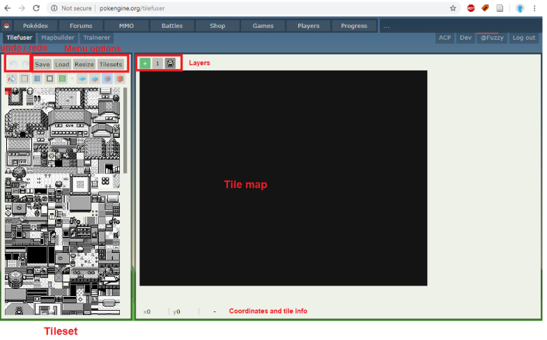

# Creating a Tilemap
## The Basics
{ align=right width=500 }When you load Tilefuser, you will see something like this screenshot opposite: a black box in the center, a tileset on the left, and various menu options and buttons above the tileset. 