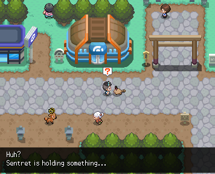

# Walking Buddies – Pokengine

Pokengine uses a combination of the walking systems from **HGSS** and **LGPE**. This system serves several purposes:

- By allowing players to bring their Pokémon out of their Poké Balls and interact with them in the overworld, it enhances immersion and connection with their party.

- It provides the most effective method for raising a Pokémon’s happiness.

- It offers an alternative way to earn money via selling what they find.

Your buddy will find a new item every **300 steps**!

!!! note
    Due to an engine oversight (also present in official Pokémon games), if you walk 300 steps and then switch your buddy, the new buddy will produce the item.

Each time your buddy finds and presents you with an item, its happiness increases by **10 points**.

---

## Buddy Gift Item List

You can also search via the following search term: `items #buddy+gift`

| Item           | Chance | Sell Price |
|----------------|--------|------------|
| Oran Berry     | 18%    | 10         |
| Stretchy Spring| 18%    | 10         |
| Chalky Stone   | 13%    | 30         |
| Hard Stone     | 12%    | 50         |
| Marble         | 11%    | 150        |
| Tiny Mushroom  | 10%    | 250        |
| Lone Earring   | 9%     | 300        |
| Big Mushroom   | 5%     | 2,500      |
| Balm Mushroom  | 3%     | 3,000      |
| Small Bouquet  | 1%     | n/a        |

---

## Eggs as Buddies

Eggs cannot find items or raise happiness. Instead, walking with your egg as a buddy allows you to monitor its progress toward hatching. Depending on how many steps you’ve walked with your egg buddy, you’ll see different hints about its progress:

- **Less than 50 steps:**  
  _"It's moving around a lot! It's going to hatch any second!"_

- **Less than 200 steps:**  
  _"Sounds can be heard coming from inside! This Egg will hatch soon!"_

- **Less than 800 steps:**  
  _"It appears to move occasionally. It may be close to hatching."_

- **Less than 2000 steps:**  
  _"The Egg seems to be closer to hatching, though it'll be a while yet."_

- **Less than 4000 steps:**  
  _"It looks as though this Egg will take a long time to hatch."_

- **Less than 10,000 steps:**  
  _"It doesn't seem close to hatching at all. This will take a long time to hatch."_

- **10,000 steps or more:**  
  _"This Egg is going to take an unbelievable amount of time to hatch, it seems."_
