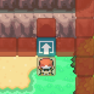

# Common Pitfalls
This page outlines the most common mistakes, quirks, and “gotchas” that can cause issues if overlooked.

## New Map Creation##
Any newly created maps may be buggy as the server doesn’t have the full data. The server updates every hour (we think) or do `/trigger reload` to manually force it to update. Travelling to maps in this state could cause black screens or get stuck in the void.

## New Map Creation##
Always remember to set the region for your map, it can cache without a region and cause issues if you don’t.

## Set a Catch Rate on New Mons##
When releasing a new region - it’s easy to forget to set a catch rate, which can lead to your Pokemon being impossible to catch.

## Out of Bounds Exploit## 
Ensure you plug every side around a warp with a solid object. Players can reload when entering/leaving and walk into the void, exploiting it to reach areas they shouldn’t.

