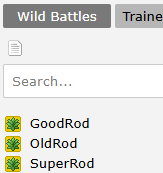

# Kyledove's Regional Weather Scheduling

Below is an example of the engine code used for the Old Rod:
## Example of Engine Code for the Old Rod

`gameEffect: game => game.player.attemptToFish("oldrod")`

As shown, it attempts to fish using the "oldrod" encounter list.

## Setting Up Rods

To set this up:  

- In Mapbuilder, create an encounter list named exactly after the rod (e.g., oldrod).  

- The system will use this list when the rod is used. 

-  You can also create custom rods by assigning them unique names and building separate encounter lists to match. 

- This allows for flexible fishing setups, such as different rods catching different Pokémon in the same area.

## Fishing for Items

In addition to Pokémon, the engine includes default functionality that allows players to occasionally fish up items instead.

This system was designed to offer alternate ways to earn money in an MMO environment, especially where trainer battles do not reset. Fishing for items adds variety and helps support economic balance by giving players repeatable, non-combat ways to profit.

There is a 1/6 chance (16.67%) to fish up an item every time you successfully reel in.

The list is as follows, but you can also search via the following search term:  
`items #fishing+chance`

| Item         | Chance (if you fish up an item) | Sell Price |
|--------------|----------------------------------|-------------|
| Trash        | 30%                              | 10          |
| Heart Scale  | 20%                              | 50          |
| Sticky Barb  | 20%                              | 100         |
| Prism Scale  | 12%                              | 250         |
| Shell Bell   | 12%                              | 100         |
| Pearl        | 4%                               | 700         |
| Big Pearl    | 3%                               | 3,750       |
| Pearl String | 2%                               | 5,000       |
| Comet Shard  | 1%                               | 15,000      |

!!! warning
    These item fishing rates are configured as engine defaults and are shared across the game.  
    Changing them may disrupt global balancing, especially in regions using GPC.  
    It’s strongly recommended to leave these values untouched unless you have a specific, isolated use case.
