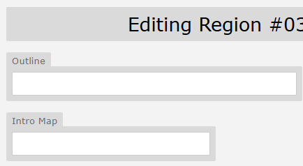

# Publishing your Region

It’s been a real labour of love, but you’ve finally reached the point where you’re ready to release your Region.

**First things first: How do you want to launch it?**
Do you want to shadow-drop it as a surprise, or build anticipation with an announcement ahead of time? If you’re going the announcement route, think about how far in advance you want to tease it - do you want to hint at it slowly, or go for a big splash?

**Most creators opt to write up a short announcement** for us to post in the #announcement channel on Discord. We’ll also update the in-game “message of the day” to let players know it’s live. Just reach out to an Admin when you're ready.

## The Process
To officially publish your region, follow the steps below:

1. **Set up your Intro Map**
 In the Region Settings in Mapbuilder, paste the UID of the map you want players to land in when they enter your Region.
 
 **Don’t do this until you're 100% sure you're ready to go live.** Once this field is filled in, the Region is considered public.

2. **Add an Outline**
 This is the short line that Zeppelina will say to players at the Airport. It gives them a quick idea of what your Region is about. **Keep this line brief or it will get cut off!**

 

 ## Region Description for the Airport Terminal
 We also ask for a slightly longer blurb for the Airport Terminal notice board. This should be about four sentences long and give players a fuller sense of what to expect.

```json
Rica=answer(Rica is a tropical region with an emphasis on exploration and features over 200 Pokemon, both new and old!|Prove your strength by defeating four gym leaders. Their badges allow you to explore deeper into the dangerous wilderness to uncover the source of the vicious wild Pokemon.|Trainers prefer double battles here, and the dungeons can be challenging, so come prepared!|Rica is complete through Rosewood Town, about halfway through the story. You can unlock the Global PC after defeating the second gym leader. The third gym will be releasing very soon!|Read about additional regions by selecting a category.)
```


!!! note "Notify, Notify, Notify!"

    Please do let an Admin know before you release your Region, even if you plan to shadow drop it.
