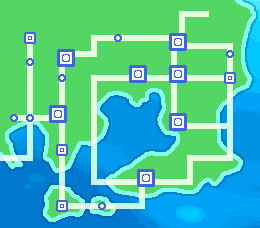
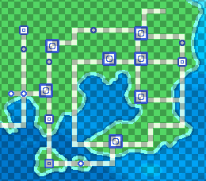
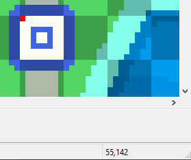
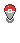
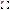

# Region Map Setup
## Introduction
Every region in Pokengine should have a Region Map (also known as the Town Map) to help players navigate.

!!! warning "Setting Up"

    This setup is not handled in Mapbuilder. You’ll need to do it via the main Pokengine website:
    Go to https://pokengine.org/regions
    Select your Region
    Click ‘Edit’ (top right corner)
    Scroll down to the Townmap section  

## Townmap Sections
Here’s what each button in the Townmap section does:
**Locations** - Place all your map data here
**Background** - Upload your region map image here (typically a full top-down view of your region).
**Player** - Set the icon that indicates the player’s current location on the map.
**Selector** - Define the hover state graphic shown when the player hovers over a location on the map.

Begin by uploading a background image for your region map. Here’s an example using the Kanto region.

**Recommended Dimensions:**
260 x 228 pixels is the suggested size for your region map image. However, this is not a strict rule - you can choose to make it smaller or larger depending on your design.

- **If your image is larger than 260 x 228:**
    The region map will be displayed inside a fixed canvas of 260 x 228 pixels. Players will need to drag and scroll the map to explore different parts since the entire image won’t fit on screen at once.

- **If your image is smaller than 260 x 228:**
    A black border will appear around the map, similar to how the Retro Kanto map looks.

!!! note "Map Amount"

    The game supports only one region map per region. For example, if you plan to add a DLC zone later within the same region, you won’t be able to display a different map image for it. Keep this limitation in mind and plan accordingly when designing your region map.

!!! tip "Kyledove's Tip"

    I always design my region maps on a grid to help organize locations and plan routes clearly. For instance, I avoid diagonal paths since players can’t walk diagonally, and those routes are tricky to create clickable selection areas for.

    In the example below, I used an 8x8 pixel grid for general layout, with cities sized at 16x16 pixels. Generally, I stick to multiples of 8 for region maps - this keeps everything neat and consistent.

    Also, be sure not to make your clickable areas (hit boxes) too small - they need to be visible and easy to click, or players might get frustrated trying to select locations!

The grid overlay is actually super useful for pulling out exact coordinates! If you save this image and open it in a photo editing tool, you can hover over locations to get their pixel coordinates. For example, I opened it in MS Paint, hovered over the top-left corner of Pallet Town, and it showed the coordinates 55,142.

## Locations Setup

Using these coordinates, you can start building the entries for the Locations section in your region map setup. Here are some examples:

- Pallet Town: 58,146,8x8=08n31ado,fly

- Route 1: 32,80,8x16=083leomi

- Viridian City: 32,72,8x8=08p8ofto,fly

- Route 2: 32,48,8x24=08hb2t2q

**Let’s break down what each part means:**

- **Label** - The name of the location shown on the region map.
This can differ from the internal map name used in Mapbuilder.

- **Coordinates** - The x,y pixel position on your region map grid
(top-left corner of the selectable area).

- **Selectable Area Size** - The width and height of the clickable area in pixels (e.g., 8x8).

- **UID (optional)** - The unique ID linking to your map in Mapbuilder, connecting the region map location to the actual map.

- **Fly (optional)** - Indicates the location is a valid Fly destination in-game.

!!! note "Optional Parameters"

    As mentioned above, the UID is optional. This means you can start building your region map locations even if you haven’t created the actual maps in Mapbuilder yet — neat and flexible! For example, "Pallet Town: 58,146,8x8" is perfectly valid syntax.

Sometimes, your route might be split into multiple sections, or you may have multiple locations with the same name. The system supports this by allowing you to add identifiers using the `#` symbol. See the example below:

- Route 104#1: 18,122,8x24=08x7hzjy  

- Route 104#2: 18,106,8x8=08x7hzjy

In this case, Route 104 in Hoenn is divided by Petalburg, so instead of one large clickable area, it’s split into two separate zones distinguished by  `#1` and `#2.`

For the player, none of this complexity is visible - they just see one seamless region map experience.

## Player and Selector Setup

This part is completely up to you, but feel free to use some of our existing assets.

The selector we provide is specifically designed for 8x8 tiles.
For the player indicator, it’s crucial that it’s clearly visible to players — a small icon can easily get lost on a colorful, busy map image.

You might be tempted to use a character’s headshot like in official games, but we generally advise against this. Since players often get to choose their character, the icon on the map may not match their choice, which can reduce immersion and player connection.

Keep it simple and visible!

!!! danger "Optional Parameters"

    There is a known flaw in the system where uploading a region map without any location data can cause the game to crash within your Region. To prevent this, always include at least one line of dummy location data - even if it doesn’t link to any existing maps.