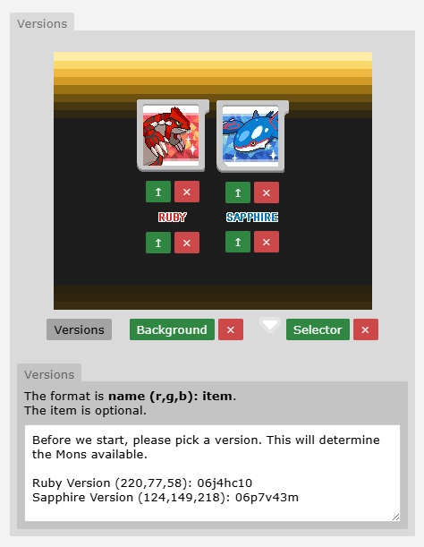
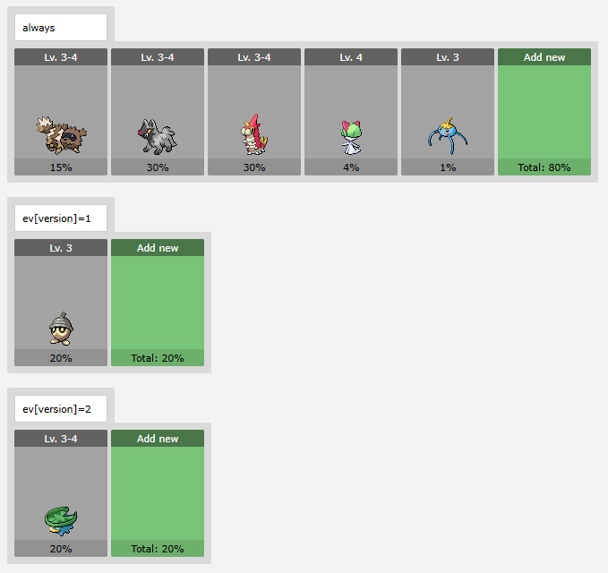

# Version System (Utilities)

You might assume that game Versions (like Red and Blue) wouldn’t work in an MMO setting – but they absolutely can! 

Splitting your Region into different Versions is a powerful way to boost replayability and player connectivity. Players may feel motivated to restart their journey just to experience the unique content in each Version. Plus, exclusive Pokémon in each Version help foster a vibrant trading community.

Currently, most Regions use Versions primarily to implement version-exclusive Pokémon. However, this system is flexible and can be adapted for a wide range of creative purposes beyond just exclusives.

---

## Creative Uses for Versions

Below is a non-exhaustive list of creative ways to use Versions:

- Version-exclusive Pokémon (including Legendaries)

- Version-exclusive storylines – each version could offer a unique perspective on a central conflict or event. One might follow one faction’s journey, while the other explores the opposing side, encouraging players to experience both for the full narrative.

- Version-specific characters – such as Rivals, Professors, or Gym Leaders (similar to Sword/Shield)

- Different rival teams or villain groups – each version could have a different antagonist (similar to Ruby/Sapphire)

- Version-specific Quests

- Version-exclusive towns or locations – while connected maps won’t support this, gatehouses or door warps can send players to different maps

- Version-specific Region differences – for example, creating versions based on seasons (Spring, Summer, Autumn, Winter), weather patterns (rainy vs. sunny), or time of day (day vs. night)

- Using versions to start the game in different locations, such as different hometowns

!!! warning
    You’re not limited to just two versions – you can create three, four, or even more!  
    However, be cautious, as too many versions can overwhelm players, especially if wild Pokémon encounters are split between them.

!!! tip
    When offering players a Version choice, it’s best to be transparent about what that choice means – whether it affects wild encounters, storylines, or other gameplay elements.

!!! note
    Alternatively, you can assign versions behind the scenes based on player decisions without them being explicitly aware.  

    For example, a professor might ask a question early on, and depending on the player’s answer, the game sets their version behind the scenes in the code.

!!! warning
    The more creatively you use multiple versions, the more development work it requires – unless you’re limiting differences to minor elements like version-exclusive wild Pokémon.  

    We recommend keeping the scope small to stay realistic and manageable.

---

## Setting Up the Version System

!!! warning
    This setup is **not** handled in Mapbuilder. You’ll need to do it via the main Pokengine website:

1. Go to [https://pokengine.org/regions](https://pokengine.org/regions)

2. Select your Region

3. Click **Edit** (top right corner)

4. Scroll down to the **Version** section

**Example:**



Use the green buttons or arrows to upload images:

- **Version Image**: The visual representing the version

- **Version Label**: The text label for the version

- **Background**: The background image (self-explanatory)

- **Selector**: The icon shown when the player is selecting a version

- **Versions**: Clicking this opens the input box where you enter version details. This text will display on the selection screen.

!!! note
    The game automatically centres and spaces the versions on the selection screen based on how many you have – pretty clever!

**Syntax:**

```
Ruby Version (220,77,58): 06j4hc10  
Sapphire Version (124,149,218): 06p7v43m
```

- **Version Name** – the name shown on screen 

- **(R,G,B)** – the colour of the text  

- **uid** *(optional)* – the item UID to add to the player’s bag upon selection

!!! note
    We often give players a “[version] Slate” item to help them track which version they’re playing, but this is optional and can be left blank.

---

## Setting up the Version Select Cutscene

To trigger the version selection cutscene in-game, add the following to your jcoad:

```
execute(cutscene=version)
```

We recommend having players choose their version at the start of the region.  
For already released regions, you can create a root object containing this jcoad and attach it to every Pokémon Centre:

```
if !ev[version]
execute(cutscene=version)
```

This will prompt version selection for players who haven’t chosen yet.

---

## Setting Up Versions Without the Selection Screen

If you want to implement versions without explicitly notifying the player, you can simply set the version event variable using jcoad normally:

```
&ev[version]=1
```

**Example:**

```
%random%=npc(01pts5bm,down)  
%random%.msg(Do you like cats or dogs better?)&answers=Yes,No  
Yes=%random%.answer(I see, cats really are superior!)&ev[version]=1  
No=%random%.answer(I see, dogs really are superior!)&ev[version]=2
```

In this example, the version event variable is set based on your answer to Brock’s question.  
When using versions this way, you don’t need to complete all the Version settings on your Region’s page.

!!! tip
    It’s still recommended to upload the version icons and names so players know multiple versions exist.

---

## Using Versions in Mapbuilder

When a player selects a version, the following event variable is set automatically:

- `ev[version] = 1` *(if they pick the 1st option)*

- `ev[version] = 2` *(if they pick the 2nd option)*

- …and so on.

You can then use this event variable throughout your region to control version-specific content.

**Example:**

```
if ev[version]=1
%random%=npc(01pts5bm,down)
%random%.msg(It’s Brock here! You picked version 1, huh? Nice choice!)
else if ev[version]=2
%random%=npc(01260rcc,down)
%random%.msg(It’s Misty here! You picked version 2, huh? Nice choice!)
```

In-game, this will display Brock or Misty depending on what version the player picked.

---

## Version-Exclusive Wild Pokémon

You can easily add version-exclusive Pokémon to any encounter.  
The field typically used for time of day can be repurposed to target specific versions instead.

!!! tip
    For easier management, it’s recommended to aim for your version encounter percentages to add up to 100%.

Example:

- `ev[version]=1`

- `ev[version]=2`

- …etc



### Conditional Logic Method

Alternatively, if you want more control, you can define version-specific encounters directly in your root object using conditional logic:

```
if ev[version]=1
encounter(grass-version-1)
else if ev[version]=2
encounter(grass-version-2)
```

This setup allows you to tailor wild encounters further, letting you combine time-based changes with version exclusivity for a more dynamic result.

!!! warning
    This approach isn’t generally recommended because:
    
    - It can quickly become difficult to manage - especially when combined with other encounter types like fishing, surfing, or weather-dependent encounters.

    - From a player’s perspective, locking pokemon behind a specific version already adds a level of exclusivity, so layering additional conditions can make obtaining certain Pokémon frustratingly complex.
